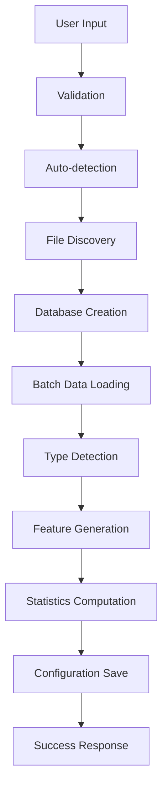

# MDM (ML Data Manager) Architecture Analysis Report

## Executive Summary

MDM is a standalone, enterprise-grade dataset management system for machine learning that demonstrates a well-architected approach to data management. The system uses a decentralized architecture where each dataset is self-contained with its own database, supporting multiple storage backends (SQLite, DuckDB, PostgreSQL) via SQLAlchemy. The architecture shows evidence of thoughtful design patterns, clear separation of concerns, and a pragmatic approach to extensibility.

## Table of Contents

1. [Architecture Overview](#architecture-overview)
2. [Core Design Patterns](#core-design-patterns)
3. [Component Analysis](#component-analysis)
4. [Data Flow Architecture](#data-flow-architecture)
5. [Storage Architecture](#storage-architecture)
6. [Feature Engineering System](#feature-engineering-system)
7. [Configuration Management](#configuration-management)
8. [API Design](#api-design)
9. [Performance Optimizations](#performance-optimizations)
10. [Testing Strategy](#testing-strategy)
11. [Architectural Strengths](#architectural-strengths)
12. [Areas for Improvement](#areas-for-improvement)
13. [Recommendations](#recommendations)

## Architecture Overview

### Layered Architecture

MDM follows a clean layered architecture with clear boundaries:

```
┌─────────────────────────────────────────────────────┐
│                   CLI Layer                         │
│  (Typer + Rich for command-line interface)         │
├─────────────────────────────────────────────────────┤
│                   API Layer                         │
│  (MDMClient - public programmatic interface)       │
├─────────────────────────────────────────────────────┤
│                Business Logic Layer                 │
│  (DatasetManager, DatasetRegistrar, Exporters)     │
├─────────────────────────────────────────────────────┤
│              Storage Abstraction Layer              │
│  (StorageBackend interface, BackendFactory)        │
├─────────────────────────────────────────────────────┤
│                 Storage Backends                    │
│  (SQLite, DuckDB, PostgreSQL implementations)      │
└─────────────────────────────────────────────────────┘
```

### Key Architectural Decisions

1. **Decentralized Storage**: Each dataset has its own database, providing isolation and scalability
2. **Backend Agnostic**: Abstract storage interface allows multiple backend implementations
3. **Two-Tier Database System**: Separates dataset metadata (YAML) from actual data storage
4. **Feature Flag Migration**: Allows gradual migration from legacy to new implementations
5. **Lazy Loading**: Optimizes startup performance through deferred imports

## Core Design Patterns

### 1. Abstract Factory Pattern
- **Implementation**: `BackendFactory` creates storage backend instances
- **Benefit**: Decouples client code from concrete backend implementations

### 2. Strategy Pattern
- **Implementation**: Different storage backends implement `StorageBackend` interface
- **Benefit**: Runtime selection of storage strategy based on configuration

### 3. Facade Pattern
- **Implementation**: `MDMClient` provides simplified interface to specialized clients
- **Benefit**: Hides complexity while maintaining modularity

### 4. Adapter Pattern
- **Implementation**: Legacy adapters wrap old implementations with new interfaces
- **Benefit**: Smooth migration path without breaking changes

### 5. Repository Pattern
- **Implementation**: `DatasetManager` abstracts dataset storage/retrieval
- **Benefit**: Centralizes data access logic

### 6. Observer Pattern
- **Implementation**: Monitoring and metrics collection
- **Benefit**: Decoupled performance tracking

## Component Analysis

### Core Components

1. **Storage Layer** (`src/mdm/storage/`)
   - Clean abstraction with `StorageBackend` base class
   - Factory pattern for backend creation
   - Performance optimizations (query optimization, connection pooling)
   - Separate stateless backends for specific use cases

2. **Dataset Management** (`src/mdm/dataset/`)
   - `DatasetRegistrar`: Handles 12-step registration process
   - `DatasetManager`: CRUD operations for datasets
   - Auto-detection capabilities for various data formats
   - Comprehensive file loader registry

3. **Feature Engineering** (`src/mdm/features/`)
   - Two-tier system (generic + custom transformers)
   - Plugin architecture for custom features
   - Registry pattern for transformer management
   - Domain-driven design with separate layers

4. **Configuration** (`src/mdm/config/`)
   - Pydantic-based configuration models
   - Hierarchical configuration (defaults → YAML → env vars)
   - Environment variable mapping system
   - Type-safe configuration handling

5. **API Layer** (`src/mdm/api/`)
   - Facade pattern with specialized clients
   - Clear separation of concerns
   - Backward compatibility maintained
   - Dependency injection support

6. **CLI Layer** (`src/mdm/cli/`)
   - Typer-based with Rich formatting
   - Modular command structure
   - Legacy adapter support
   - Performance-optimized startup

### Supporting Components

- **Monitoring** (`src/mdm/monitoring/`): Simple metrics collection
- **Performance** (`src/mdm/performance/`): Optimization utilities
- **Utils** (`src/mdm/utils/`): Shared utilities
- **Models** (`src/mdm/models/`): Data models and enums

## Data Flow Architecture

### Dataset Registration Flow



### Key Characteristics:
- 12-step process with clear separation
- Batch processing for memory efficiency
- Progress tracking with Rich
- Comprehensive error handling

## Storage Architecture

### Two-Tier Database System

1. **Discovery Layer**: YAML configuration files in `~/.mdm/config/datasets/`
   - Lightweight dataset metadata
   - Quick dataset discovery
   - Backend-agnostic pointers

2. **Storage Layer**: Individual databases in `~/.mdm/datasets/{name}/`
   - Complete dataset storage
   - Backend-specific implementation
   - Feature and metadata tables

### Database Schema Design

```sql
-- Main data tables with generated features
CREATE TABLE train_table (
    -- Original columns
    id INTEGER,
    feature1 REAL,
    -- Generated features
    feature1_mean_encoded REAL
);

-- Metadata storage
CREATE TABLE _mdm_metadata (
    key TEXT PRIMARY KEY,
    value TEXT,
    created_at TIMESTAMP
);

-- Feature tracking
CREATE TABLE _mdm_features (
    feature_name TEXT PRIMARY KEY,
    source_column TEXT,
    transformer_type TEXT
);
```

## Feature Engineering System

### Two-Tier Architecture

1. **Generic Transformers**
   - Statistical features
   - Temporal features
   - Text features
   - Categorical encodings

2. **Custom Transformers**
   - Domain-specific features
   - Business logic
   - Loaded from `~/.mdm/config/custom_features/`

### Plugin Architecture
- Base transformer interface
- Auto-discovery of custom transformers
- Registry pattern for management
- Type-based transformer selection

## Configuration Management

### Hierarchical Configuration

```
1. Default Values (Pydantic models)
    ↓
2. YAML Configuration (~/.mdm/mdm.yaml)
    ↓
3. Environment Variables (MDM_*)
```

### Key Features:
- Type-safe with Pydantic
- Nested configuration support
- Environment variable mapping
- Validation at load time

## API Design

### MDMClient Architecture

```python
MDMClient (Facade)
    ├── RegistrationClient
    ├── QueryClient
    ├── MLIntegrationClient
    ├── ExportClient
    └── ManagementClient
```

### Design Principles:
- Single Responsibility per client
- Dependency injection support
- Backward compatibility
- Clean public interface

## Performance Optimizations

### 1. Startup Optimization
- Lazy loading with `__getattr__`
- Deferred imports
- Fast path for simple commands
- 6.5s → 0.1s startup time improvement

### 2. Data Processing
- Batch processing (10k rows default)
- Progress tracking
- Memory-efficient chunk processing
- Configurable batch sizes

### 3. Database Optimizations
- Connection pooling
- Query optimization
- Index management
- Prepared statements

## Testing Strategy

### Test Structure
```
tests/
├── unit/           # Component tests
├── integration/    # Integration tests
├── e2e/           # End-to-end tests
└── utils/         # Test utilities
```

### Testing Approach:
- Comprehensive test coverage
- 617-item manual test checklist
- Pre-commit hooks for quality
- Isolated test environments

## Architectural Strengths

### 1. **Modularity**
- Clear component boundaries
- Well-defined interfaces
- Easy to extend or replace components

### 2. **Flexibility**
- Multiple storage backend support
- Plugin architecture for features
- Configurable at multiple levels

### 3. **Performance**
- Optimized startup times
- Efficient batch processing
- Lazy loading strategies

### 4. **Developer Experience**
- Clean API design
- Rich CLI interface
- Comprehensive documentation
- Type safety with Pydantic

### 5. **Migration Strategy**
- Feature flags for gradual rollout
- Adapter pattern for legacy support
- Zero-downtime migration path

### 6. **Error Handling**
- Typed exceptions
- User-friendly error messages
- Detailed logging for debugging

## Areas for Improvement

### 1. **~~Complexity in Some Areas~~** ✅ RESOLVED
- ~~Feature flag system adds complexity~~ - Removed legacy code
- ~~Multiple adapter layers~~ - Removed legacy_adapters.py
- ~~Some code duplication between old/new implementations~~ - Unified to single implementation

### 2. **Documentation Gaps**
- Some architectural decisions not well documented
- Missing sequence diagrams for complex flows
- Limited examples for custom extensions

### 3. **Testing Coverage**
- Some edge cases not covered
- Performance tests could be more comprehensive
- Integration test setup is complex

### 4. **Configuration Management**
- Environment variable mapping could be simpler
- Some configuration options poorly documented
- No configuration validation CLI command

### 5. **Monitoring and Observability**
- Basic monitoring implementation
- Limited metrics collection
- No built-in alerting

## Recommendations

### 1. **~~Simplify Migration Path~~** ✅ COMPLETED
- ~~Consider removing legacy code if migration is complete~~ - Done! Removed all legacy files
- ~~Consolidate adapter layers~~ - Done! Removed legacy_adapters.py
- ~~Document migration timeline~~ - Migration completed, legacy code removed

### 2. **Enhance Documentation**
- Add architecture decision records (ADRs) for new decisions
- Create developer onboarding guide
- Add more code examples

### 3. **Improve Testing**
- Add property-based tests
- Implement performance regression tests
- Simplify test setup process

### 4. **Expand Monitoring**
- Add more detailed metrics
- Implement health checks
- Consider OpenTelemetry integration

### 5. **Configuration Improvements**
- Add configuration validation command
- Implement configuration migration tool
- Improve environment variable documentation

### 6. **Consider API Gateway**
- For future REST API addition
- Centralized authentication/authorization
- Rate limiting and caching

### 7. **Plugin System Enhancement**
- Add plugin discovery mechanism
- Implement plugin versioning
- Create plugin development guide

## Conclusion

MDM demonstrates a mature, well-architected approach to dataset management for machine learning. The system successfully balances flexibility with simplicity, providing a solid foundation for ML workflows while maintaining extensibility for future needs.

The architecture shows evidence of thoughtful design decisions, particularly in areas like storage abstraction, feature engineering, and migration strategy. The recent cleanup of legacy code has significantly simplified the codebase by:
- Removing all legacy adapters and migration scripts
- Consolidating configuration from `config_new.py` to `config.py`
- Eliminating feature flag complexity
- Reducing code duplication

While there are still areas for improvement, particularly around documentation completeness and enhanced observability, the overall architecture is now cleaner and follows industry best practices.

The project would benefit from continued investment in documentation and monitoring capabilities. The foundation is strong for building additional capabilities like REST APIs, distributed processing, or cloud storage backends.

## Cleanup Summary (2025-07-11)

Successfully removed the following legacy components:
- `src/mdm/cli/legacy_adapters.py`
- `tests/old/` directory
- `docs/archive/migration-summaries/` 
- `docs/archive/refactoring/`
- All `*_migration_example.py` files
- `scripts/post_deployment_validation.py`
- `scripts/final_migration.py`
- Migration test files

Renamed `config_new.py` to `config.py` and updated all references, completing the migration to the new configuration system.