# MDM Architecture Diagrams

This file contains Mermaid diagrams used throughout the MDM documentation.

## System Architecture

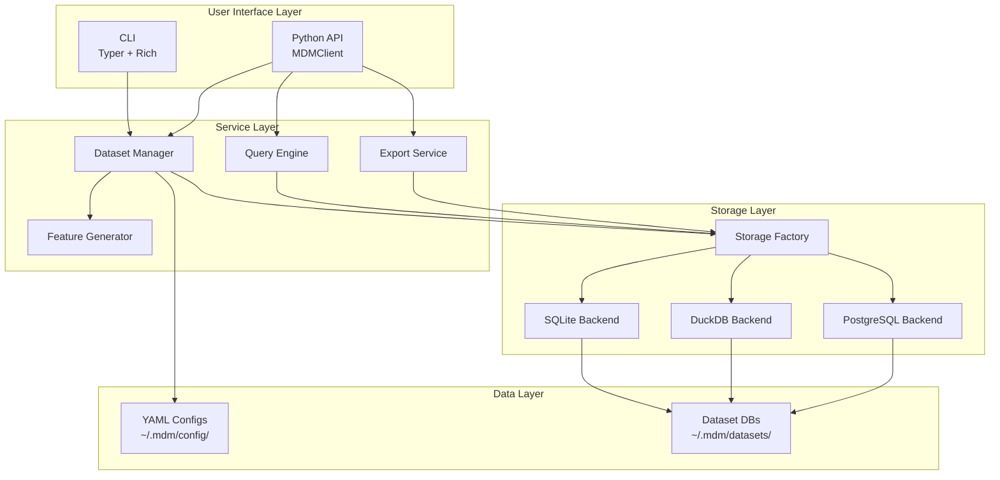

## Data Flow

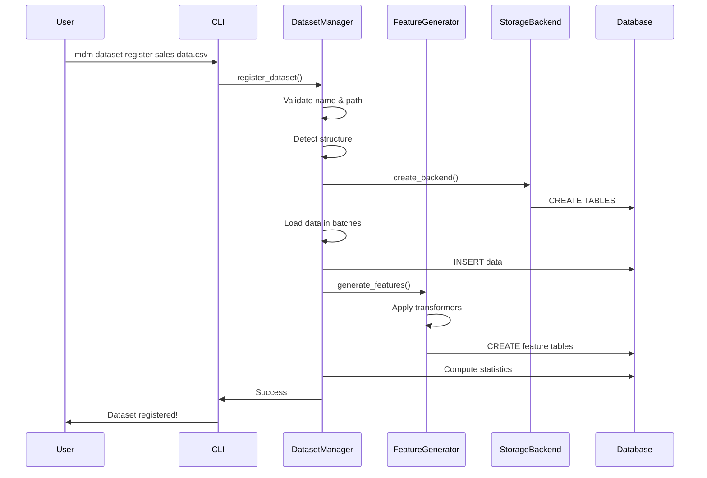

## Feature Engineering Pipeline

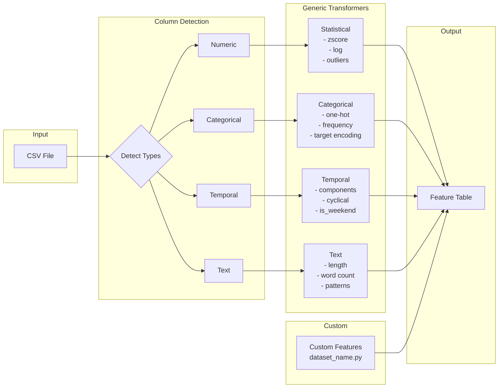

## Storage Architecture

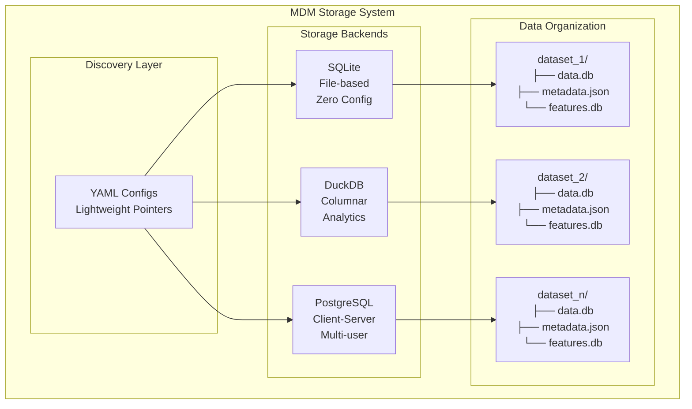

## Query Execution

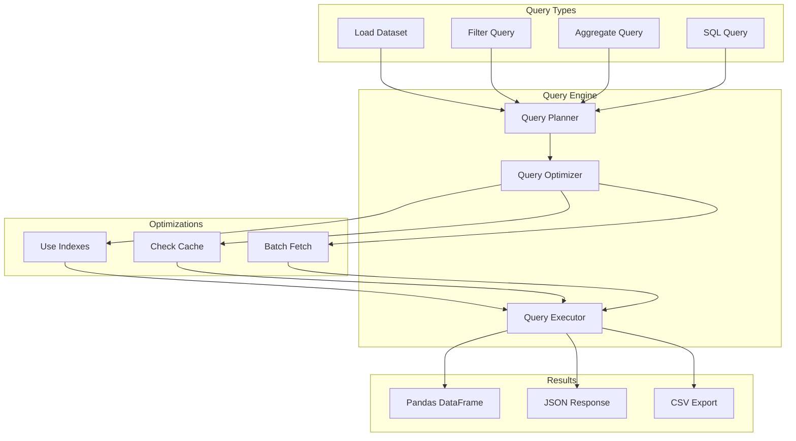

## ML Integration Flow

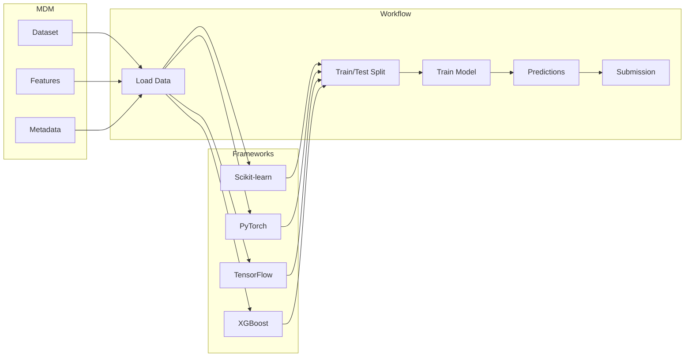

## Configuration Hierarchy

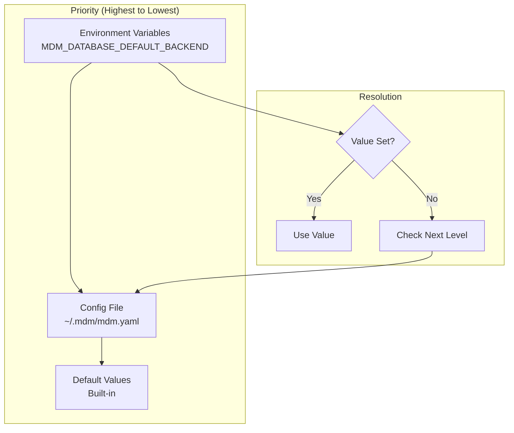

## Performance Optimization

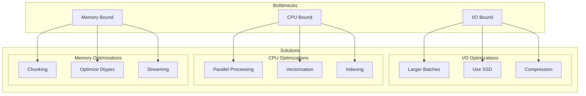

## Dataset Lifecycle

```mermaid
stateDiagram-v2
    [*] --> Raw: Data File
    Raw --> Validating: mdm register
    Validating --> Loading: Validation OK
    Validating --> [*]: Validation Failed
    Loading --> TypeDetection: Load Batches
    TypeDetection --> FeatureGen: Detect Types
    FeatureGen --> Statistics: Generate Features
    Statistics --> Ready: Compute Stats
    Ready --> InUse: Dataset Active
    InUse --> Updated: mdm update
    Updated --> Ready: Re-process
    InUse --> Exported: mdm export
    InUse --> Removed: mdm remove
    Removed --> [*]: Cleanup
```

## Error Handling Flow

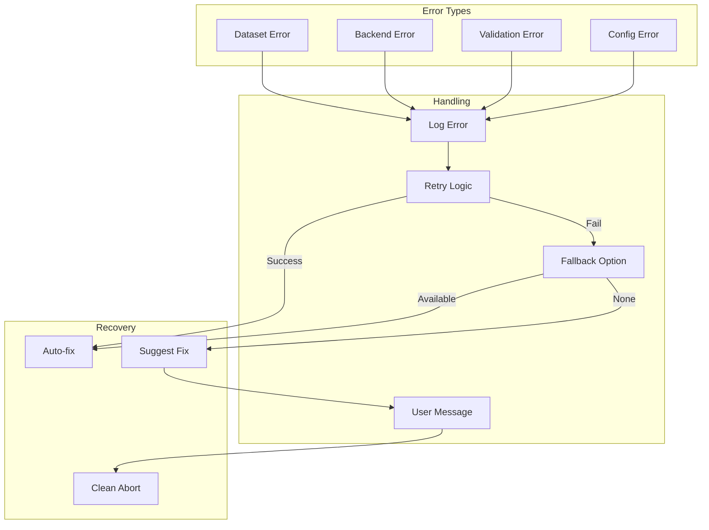

## Backend Selection

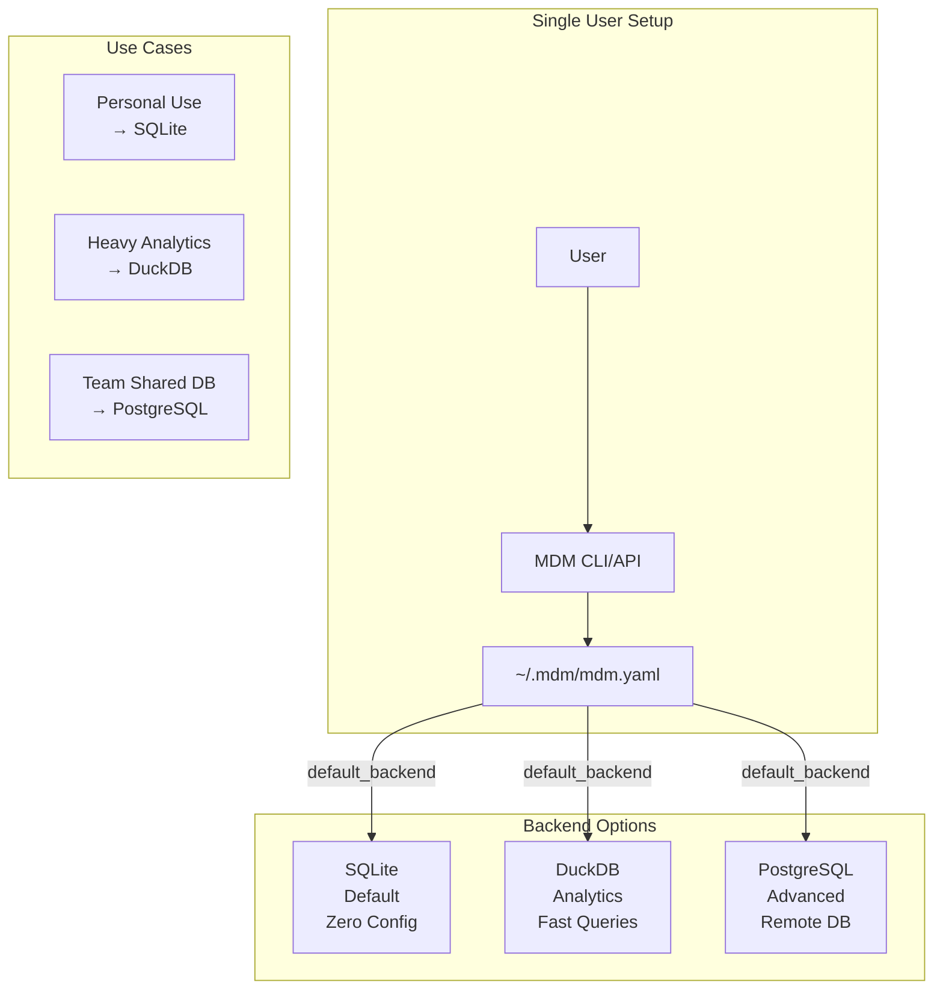

These diagrams can be rendered in any Markdown viewer that supports Mermaid (GitHub, GitLab, many documentation tools).