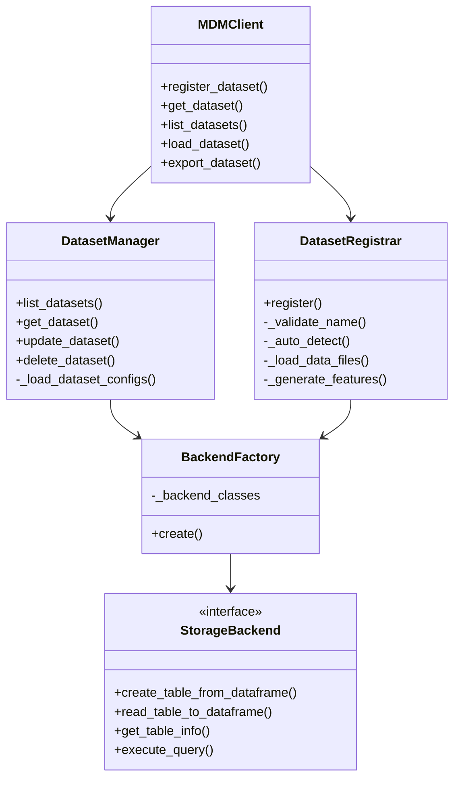
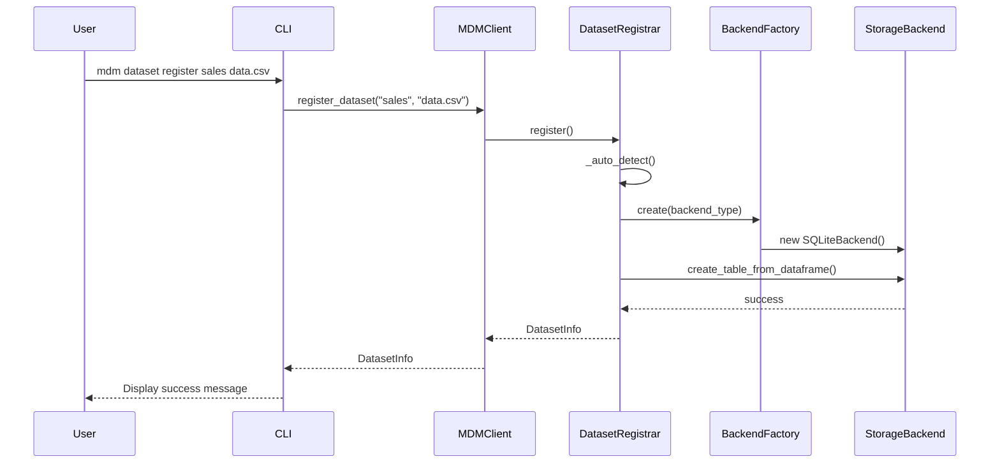
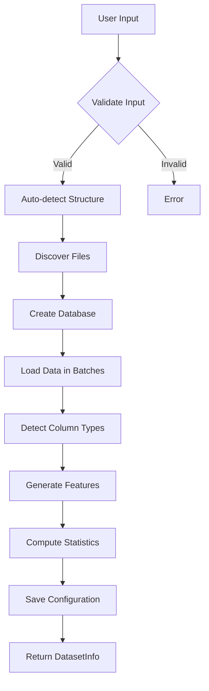
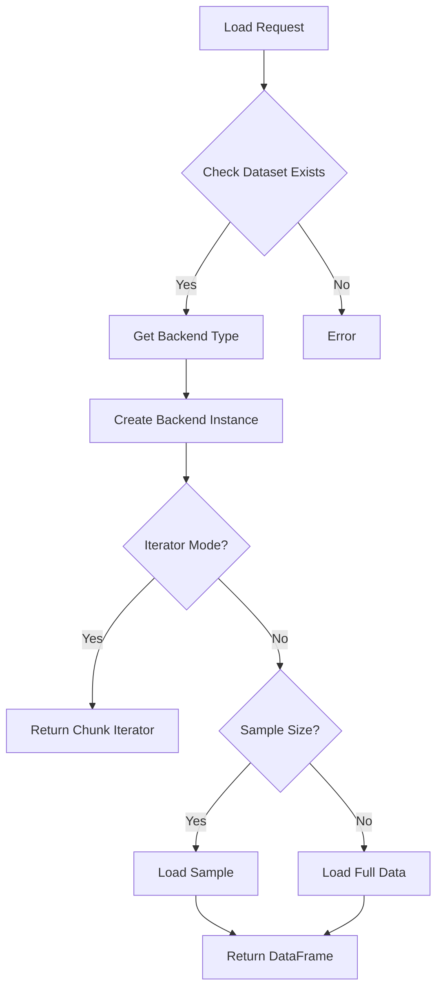
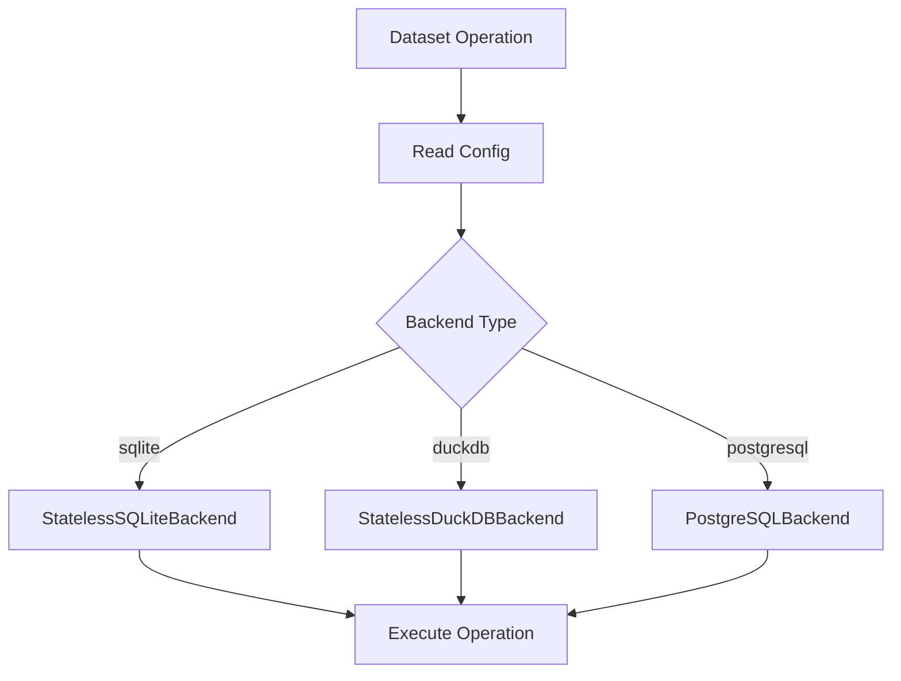
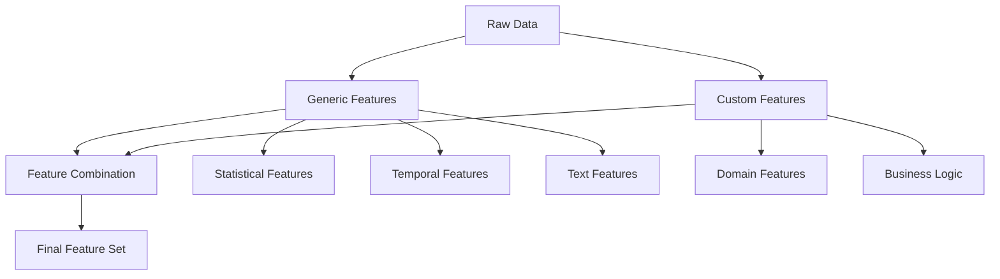
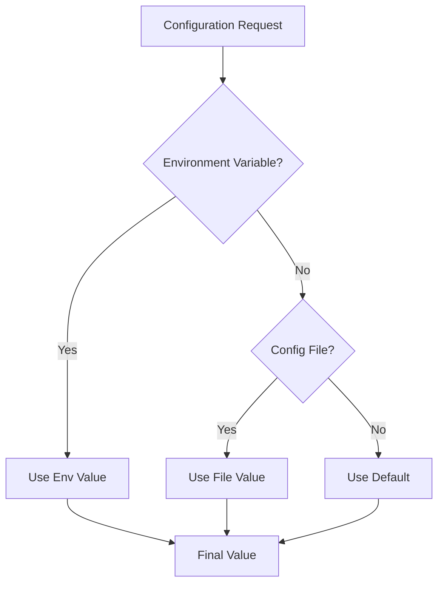
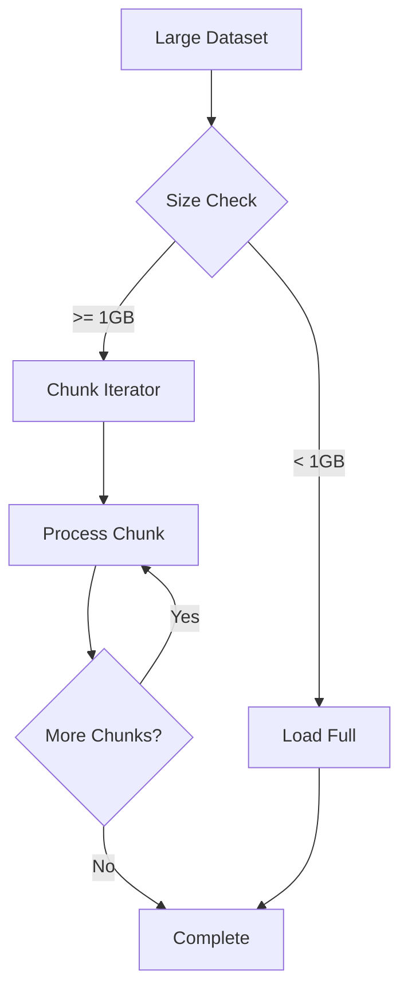

# MDM Architecture & Design

## Table of Contents
1. [System Architecture](#system-architecture)
2. [Component Design](#component-design)
3. [Data Flow](#data-flow)
4. [Storage Architecture](#storage-architecture)
5. [Feature Engineering Architecture](#feature-engineering-architecture)
6. [Configuration Architecture](#configuration-architecture)
7. [Security & Performance](#security--performance)
8. [Extension Points](#extension-points)

## System Architecture

### Overview

MDM follows a layered architecture pattern with clear separation of concerns:

```
┌─────────────────────────────────────────────────────┐
│                   CLI Layer                         │
│  (Typer + Rich for command-line interface)         │
├─────────────────────────────────────────────────────┤
│                   API Layer                         │
│  (MDMClient - public programmatic interface)       │
├─────────────────────────────────────────────────────┤
│                Business Logic Layer                 │
│  (DatasetManager, DatasetRegistrar, Exporters)     │
├─────────────────────────────────────────────────────┤
│              Storage Abstraction Layer              │
│  (StorageBackend interface, BackendFactory)        │
├─────────────────────────────────────────────────────┤
│                 Storage Backends                    │
│  (SQLite, DuckDB, PostgreSQL implementations)      │
└─────────────────────────────────────────────────────┘
```

### Design Principles

1. **Separation of Concerns**: Each layer has a specific responsibility
2. **Dependency Injection**: Components receive dependencies rather than creating them
3. **Interface Segregation**: Small, focused interfaces for each component
4. **Open/Closed Principle**: Open for extension (new backends), closed for modification
5. **Single Responsibility**: Each class has one reason to change

## Component Design

### Core Components



### Component Interactions



## Data Flow

### Registration Flow



### Data Loading Flow



## Storage Architecture

### Database Structure

Each dataset has its own database with standardized tables:

```sql
-- Main data tables
CREATE TABLE train (
    -- Original columns from source data
    id INTEGER,
    feature1 REAL,
    feature2 TEXT,
    target INTEGER
);

CREATE TABLE test (
    -- Same structure as train table
);

-- Additional tables based on dataset structure
CREATE TABLE data (          -- For single-file datasets
    -- All columns from source
);

CREATE TABLE submission (    -- For Kaggle-style datasets
    -- Submission format columns
);

-- Generated feature tables
CREATE TABLE train_features (
    -- Original columns plus generated features
    id INTEGER,
    feature1 REAL,
    feature2 TEXT,
    target INTEGER,
    -- Generated feature columns
    feature1_zscore REAL,
    feature1_log REAL,
    feature2_length INTEGER,
    feature2_word_count INTEGER
);

-- Metadata table
CREATE TABLE _metadata (
    key TEXT PRIMARY KEY,
    value TEXT,
    created_at TIMESTAMP,
    updated_at TIMESTAMP
);
```

### Backend Abstraction

MDM uses two backend patterns:

1. **Stateless Backends** (SQLite, DuckDB) - Lighter weight, no persistent connection
2. **Stateful Backends** (PostgreSQL) - Traditional connection management

```python
class StorageBackend(ABC):
    """Abstract base class for storage backends."""
    
    @property
    @abstractmethod
    def backend_type(self) -> str:
        """Get backend type identifier."""
        pass
    
    @abstractmethod
    def create_engine(self, database_path: str) -> Engine:
        """Create SQLAlchemy engine for the database."""
        pass
    
    @abstractmethod
    def initialize_database(self, engine: Engine) -> None:
        """Initialize database with required tables."""
        pass
    
    @abstractmethod
    def get_database_path(self, dataset_name: str, base_path: Path) -> str:
        """Get database path or connection string for dataset."""
        pass
    
    # Concrete methods (not abstract)
    def get_engine(self, database_path: str) -> Engine:
        """Get or create SQLAlchemy engine."""
        # Implementation provided in base class
    
    def create_table_from_dataframe(
        self,
        df: pd.DataFrame,
        table_name: str,
        engine: Any,
        if_exists: str = 'replace',
        index: bool = False,
        dtype: Optional[Dict[str, Any]] = None
    ) -> None:
        """Create table from pandas DataFrame."""
        # Implementation provided in base class
    
    def read_table_to_dataframe(
        self,
        table_name: str,
        engine: Any,
        columns: Optional[List[str]] = None,
        limit: Optional[int] = None,
        offset: int = 0
    ) -> pd.DataFrame:
        """Read table into pandas DataFrame."""
        # Implementation provided in base class

# Stateless backend example
class StatelessSQLiteBackend(StorageBackend):
    """Stateless implementation - creates engine on demand."""
    
    def get_engine(self, connection_string: str) -> Engine:
        # Create fresh engine for each operation
        return create_engine(connection_string)
```

### Performance Optimization Components

The base StorageBackend class includes performance optimizations:

```python
class StorageBackend:
    def __init__(self, config: dict[str, Any]):
        self.config = config
        # Performance optimization components
        self._query_optimizer: Optional[QueryOptimizer] = None
        self._connection_pool: Optional[ConnectionPool] = None
        self._cache_manager: Optional[CacheManager] = None
        self._batch_optimizer: Optional[BatchOptimizer] = None
        
        # Initialize if enabled
        if config.get('enable_performance_optimizations', True):
            self._initialize_performance_optimizations()
```

### Backend Selection



## Feature Engineering Architecture

### Two-Tier System



### Feature Generation Pipeline

```python
class FeatureGenerator:
    def __init__(self):
        self.generic_transformers = self._load_generic_transformers()
        self.custom_transformers = self._load_custom_transformers()
    
    def generate(
        self,
        df: pd.DataFrame,
        column_types: Dict[str, ColumnType],
        target_column: Optional[str] = None
    ) -> pd.DataFrame:
        # Apply generic transformers
        for transformer in self.generic_transformers:
            if transformer.can_handle(column_types):
                df = transformer.transform(df)
        
        # Apply custom transformers
        for transformer in self.custom_transformers:
            df = transformer.transform(df)
        
        return df
```

### Transformer Interface

```python
class BaseTransformer(ABC):
    """Base class for feature transformers."""
    
    @abstractmethod
    def fit(self, df: pd.DataFrame) -> 'BaseTransformer':
        """Fit transformer to data."""
        pass
    
    @abstractmethod
    def transform(self, df: pd.DataFrame) -> pd.DataFrame:
        """Transform data."""
        pass
    
    def fit_transform(self, df: pd.DataFrame) -> pd.DataFrame:
        """Fit and transform in one step."""
        return self.fit(df).transform(df)
```

## Configuration Architecture

### Configuration Hierarchy



### Configuration Model

```python
class MDMConfig(BaseSettings):
    """Main configuration model using Pydantic."""
    
    database: DatabaseConfig = DatabaseConfig()
    performance: PerformanceConfig = PerformanceConfig()
    features: FeaturesConfig = FeaturesConfig()
    logging: LoggingConfig = LoggingConfig()
    paths: PathsConfig = PathsConfig()
    
    class Config:
        env_prefix = "MDM_"
        env_nested_delimiter = "_"
        case_sensitive = False

class DatabaseConfig(BaseModel):
    default_backend: str = "sqlite"
    sqlite: SQLiteConfig = SQLiteConfig()
    duckdb: DuckDBConfig = DuckDBConfig()
    postgresql: PostgreSQLConfig = PostgreSQLConfig()
```

### Environment Variable Mapping

```
MDM_DATABASE_DEFAULT_BACKEND=postgresql
MDM_DATABASE_POSTGRESQL_HOST=localhost
MDM_DATABASE_POSTGRESQL_PORT=5432
MDM_PERFORMANCE_BATCH_SIZE=50000
MDM_LOGGING_LEVEL=DEBUG
```

## Security & Performance

### Security Considerations

1. **Input Validation**: All user inputs validated with Pydantic
2. **SQL Injection Prevention**: Use parameterized queries via SQLAlchemy
3. **File Access Control**: Validate file paths, prevent directory traversal
4. **Sensitive Data**: No credentials in logs, use environment variables
5. **Error Messages**: Generic errors for users, detailed logs for debugging

### Performance Optimizations

1. **Batch Processing**
   ```python
   # Load data in chunks
   for chunk in pd.read_csv(file_path, chunksize=10000):
       process_chunk(chunk)
   ```

2. **Connection Pooling**
   ```python
   # SQLAlchemy connection pool
   engine = create_engine(
       connection_string,
       pool_size=5,
       max_overflow=10,
       pool_pre_ping=True
   )
   ```

3. **Lazy Loading**
   ```python
   # Load only requested columns
   df = backend.read_table_to_dataframe(
       table_name,
       columns=['id', 'amount']
   )
   ```

4. **Index Optimization**
   ```python
   # Create indexes on frequently queried columns via QueryOptimizer
   optimizer = QueryOptimizer(backend_type)
   optimizer.create_indexes(table_name, ['id', 'created_at'], connection)
   ```

### Memory Management



## Extension Points

### Adding New Storage Backend

1. Create new backend class:
```python
# src/mdm/storage/mongodb.py
from mdm.storage.base import StorageBackend

class MongoDBBackend(StorageBackend):
    def __init__(self, config: Dict[str, Any]):
        self.client = MongoClient(**config)
    
    def create_table_from_dataframe(self, df, table_name, ...):
        # Implementation
        pass
```

2. Register in BackendFactory:
```python
# src/mdm/storage/factory.py
class BackendFactory:
    _backends = {
        "sqlite": StatelessSQLiteBackend,
        "duckdb": StatelessDuckDBBackend,
        "postgresql": PostgreSQLBackend,
        "mongodb": MongoDBBackend  # Add here
    }
    
    @classmethod
    def create(cls, backend_type: str, config: dict[str, Any]) -> StorageBackend:
        if backend_type not in cls._backends:
            raise BackendError(f"Unsupported backend type: {backend_type}")
        
        backend_class = cls._backends[backend_type]
        
        # Stateless backends don't take config in constructor
        if backend_type in ["sqlite", "duckdb", "mongodb"]:
            return backend_class()
        else:
            # Stateful backends take config
            return backend_class(config)
```

3. Add configuration:
```python
# src/mdm/config.py
class MongoDBConfig(BaseModel):
    host: str = "localhost"
    port: int = 27017
    database: str = "mdm"
```

### Adding New Feature Transformers

1. Create custom feature class:
```python
# ~/.mdm/config/custom_features/{dataset_name}.py
from mdm.features.custom.base import BaseDomainFeatures
from typing import Dict
import pandas as pd

class CustomFeatureOperations(BaseDomainFeatures):
    def __init__(self):
        super().__init__('{dataset_name}')
    
    def _register_operations(self):
        """Register feature operations."""
        self._operation_registry = {
            'time_features': self.calculate_time_features
        }
    
    def calculate_time_features(self, df: pd.DataFrame) -> Dict[str, pd.Series]:
        """Calculate time-based features."""
        features = {}
        for col in df.select_dtypes(include=[np.number]).columns:
            features[f'{col}_rolling_mean_7'] = df[col].rolling(7).mean()
            features[f'{col}_rolling_std_7'] = df[col].rolling(7).std()
        return features
```

2. Custom features are automatically loaded from `~/.mdm/config/custom_features/` directory

### Adding New CLI Commands

1. Create command module:
```python
# src/mdm/cli/analyze.py
from typer import Typer

app = Typer()

@app.command()
def quality(dataset_name: str):
    """Analyze dataset quality."""
    # Implementation
```

2. Register in main CLI:
```python
# src/mdm/cli/main.py
from mdm.cli import analyze

app.add_typer(analyze.app, name="analyze")
```

### Integration Points

1. **ML Frameworks**: Load data directly into framework formats
2. **Data Catalogs**: Export metadata for data catalogs
3. **Monitoring**: Export metrics for monitoring systems
4. **CI/CD**: Automated dataset validation in pipelines

## Deployment Considerations

### Single User Deployment
```yaml
# ~/.mdm/mdm.yaml
database:
  default_backend: sqlite
paths:
  base_path: ~/.mdm
```

### Team Deployment
```yaml
# ~/.mdm/mdm.yaml
database:
  default_backend: postgresql
  postgresql:
    host: shared-db.company.com
    port: 5432
    database: mdm_prod
```

### Docker Deployment
```dockerfile
FROM python:3.11-slim
RUN pip install mdm
ENV MDM_DATABASE_DEFAULT_BACKEND=postgresql
ENV MDM_DATABASE_POSTGRESQL_HOST=db
# Note: MDM is currently a CLI tool only
# Future versions may include an API server
```