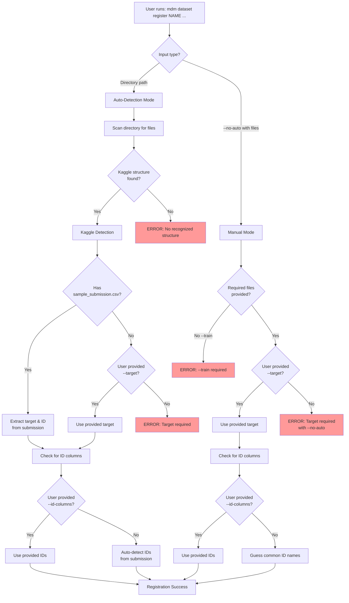

# Target and ID Column Detection Schema

This document describes the complete logic for detecting target and ID columns in MDM based on different input scenarios.

## Detection Flow Diagram



## Detailed Detection Rules

### 1. Auto-Detection Mode (Default)

When user provides a directory path without `--no-auto`:

```bash
mdm dataset register NAME /path/to/directory
```

#### Step 1: File Discovery
System scans for these file patterns (case-insensitive):
- **Train**: `train.csv`, `training.csv`, `train_data.csv`, `X_train.csv`
- **Test**: `test.csv`, `testing.csv`, `test_data.csv`, `X_test.csv`
- **Submission**: `sample_submission.csv`, `submission.csv`, `sample.csv`

#### Step 2: Structure Recognition

**Kaggle Structure Detected** if found:
- At least one train file AND
- At least one test file

**No Structure** → ERROR:
```
✗ Auto-detection failed: No recognized dataset structure found.

Found files: [list of files]
Expected structure for Kaggle datasets:
  - train.csv (or similar training file)
  - test.csv (or similar test file)
  - sample_submission.csv (for target detection)

Options:
1. Use --no-auto and specify files explicitly
2. Reorganize your data to match expected structure
```

#### Step 3: Target Detection

| Scenario | Has submission.csv | User provided --target | Result |
|----------|-------------------|----------------------|---------|
| 1 | ✅ Yes | ❌ No | Extract target from submission |
| 2 | ✅ Yes | ✅ Yes | Use user's target (override) |
| 3 | ❌ No | ✅ Yes | Use user's target |
| 4 | ❌ No | ❌ No | **ERROR: Target required** |

**Target Extraction from submission.csv**:
1. Read submission file columns
2. Remove known ID patterns: `id`, `ID`, `Id`, `*_id`, `*_ID`
3. Remaining column = target column
4. If multiple remain → **ERROR: Ambiguous target**

#### Step 4: ID Column Detection

| Scenario | Has submission.csv | User provided --id-columns | Result |
|----------|-------------------|--------------------------|---------|
| 1 | ✅ Yes | ❌ No | Extract IDs from submission |
| 2 | ✅ Yes | ✅ Yes | Use user's IDs (override) |
| 3 | ❌ No | ✅ Yes | Use user's IDs |
| 4 | ❌ No | ❌ No | Auto-detect common patterns |

**ID Auto-Detection Patterns**:
- Exact matches: `id`, `ID`, `Id`
- Suffix patterns: `*_id`, `*_ID`, `*Id`
- Common names: `index`, `row_id`, `record_id`

### 2. Manual Mode (--no-auto)

When user explicitly disables auto-detection:

```bash
mdm dataset register NAME --no-auto --train FILE --test FILE --target COLUMN
```

#### Required Parameters
- `--train`: Path to training file (REQUIRED)
- `--target`: Target column name (REQUIRED)

#### Optional Parameters
- `--test`: Path to test file
- `--validation`: Path to validation file
- `--id-columns`: Comma-separated ID columns

#### Validation Rules

| Check | Condition | Error Message |
|-------|-----------|--------------|
| No directory | PATH provided with --no-auto | "Directory path not allowed with --no-auto" |
| No train | --train not provided | "--train is required with --no-auto" |
| No target | --target not provided | "--target is required with --no-auto" |

### 3. Mixed Mode Examples

#### Override auto-detected target:
```bash
# Auto-detects files but uses specified target
mdm dataset register titanic /kaggle/titanic --target "Survived"
```

#### Override auto-detected IDs:
```bash
# Auto-detects everything but uses specified ID columns
mdm dataset register sales /data/sales --id-columns "OrderID,CustomerID"
```

## Error Messages Reference

### 1. No Structure Found
```
✗ Auto-detection failed: No recognized dataset structure found.

Found files: data.xlsx, README.md, metadata.json
Expected structure for Kaggle datasets:
  - train.csv (or similar training file)
  - test.csv (or similar test file)
  - sample_submission.csv (for target detection)
```

### 2. Target Not Found
```
✗ Registration failed: Target column not specified and could not be auto-detected.

Found: train.csv, test.csv
Missing: sample_submission.csv (needed for target auto-detection)

Please specify the target column:
  mdm dataset register sales /data/sales --target "revenue"
```

### 3. Ambiguous Target
```
✗ Registration failed: Multiple potential target columns found in submission.

Columns in sample_submission.csv: [PassengerId, Survived, Confidence]
After removing ID columns: [Survived, Confidence]

Please specify which column is the target:
  mdm dataset register titanic /data/titanic --target "Survived"
```

### 4. Manual Mode Errors
```
✗ Error: --train is required when using --no-auto
✗ Error: --target is required when using --no-auto
✗ Error: Directory path not allowed with --no-auto flag
```

## Implementation Priority

The detection follows this priority order:

1. **User overrides** always take precedence
2. **Auto-detection from files** (submission.csv)
3. **Pattern matching** (for IDs)
4. **Error with helpful message**

## Examples

### Successful Kaggle Detection
```bash
mdm dataset register titanic /kaggle/titanic

# Auto-detects:
# - Files: train.csv, test.csv, sample_submission.csv
# - Target: Survived (from submission)
# - ID: PassengerId (from submission)
```

### Manual Registration
```bash
mdm dataset register custom_data --no-auto \
  --train /data/training_set.parquet \
  --test /data/test_set.parquet \
  --target "price" \
  --id-columns "item_id,store_id"
```

### Mixed Mode
```bash
# Let auto-detection find files, but specify target
mdm dataset register house_prices /kaggle/house-prices \
  --target "SalePrice" \
  --problem-type "regression"
```