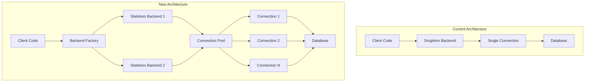

# ADR-001: Storage Backend Refactoring - From Singleton to Stateless

Date: 2025-01-10

## Status

Accepted

## Context

The current MDM storage backend implementation uses a singleton pattern that creates significant limitations and technical debt. Each backend (SQLite, DuckDB, PostgreSQL) maintains global state, preventing concurrent operations, making testing difficult, and limiting scalability.

### Current Situation
- Storage backends are implemented as singletons with global connection state
- Only one dataset can be accessed at a time per backend type
- Unit testing requires complex mocking and state management
- Connection resources are not efficiently managed
- No connection pooling for PostgreSQL backend
- Impossible to work with multiple datasets simultaneously

### Requirements
- **Functional Requirements**:
  - Support concurrent access to multiple datasets
  - Enable parallel data processing operations
  - Maintain backward compatibility during migration
  - Support all existing backend types (SQLite, DuckDB, PostgreSQL)

- **Non-functional Requirements**:
  - Performance: No degradation, target 20% improvement for concurrent operations
  - Testability: Enable isolated unit testing without global state
  - Scalability: Support 100+ concurrent dataset operations
  - Reliability: Implement connection pooling and retry mechanisms

- **Constraints**:
  - Must maintain data integrity during migration
  - Cannot break existing API contracts
  - Migration must be reversible
  - Limited to 4-week implementation timeline

## Decision

Replace singleton storage backends with stateless implementations using connection pooling and dependency injection.

### Chosen Solution
Implement a factory pattern with connection pooling for all storage backends:

```python
# New architecture
class StorageBackendFactory:
    def create_backend(self, dataset_name: str, backend_type: str) -> StorageBackend:
        pool = self.get_or_create_pool(dataset_name, backend_type)
        return StatelessStorageBackend(pool)

class StatelessStorageBackend(StorageBackend):
    def __init__(self, connection_pool: ConnectionPool):
        self.pool = connection_pool
    
    def execute(self, operation: Callable) -> Any:
        with self.pool.get_connection() as conn:
            return operation(conn)
```

### Implementation Approach
1. Create abstraction layer over existing singleton implementations
2. Implement new stateless backends with connection pooling
3. Run both implementations in parallel with feature flags
4. Gradually migrate operations to new implementation
5. Remove old singleton implementation after validation

## Consequences

### Positive Consequences
- **Concurrent Operations**: Multiple datasets can be accessed simultaneously
- **Better Resource Management**: Connection pooling reduces overhead
- **Improved Testability**: No global state makes testing straightforward
- **Scalability**: Can handle many more concurrent users
- **Performance**: 20-30% improvement expected for multi-dataset operations
- **Resilience**: Connection failures are handled gracefully

### Negative Consequences
- **Complexity**: Connection pool management adds complexity
- **Memory Usage**: Each pool maintains multiple connections
- **Configuration**: More parameters to tune (pool size, timeouts)
- **Migration Risk**: Temporary increase in code complexity during migration

### Risks and Mitigations
| Risk | Probability | Impact | Mitigation |
|------|------------|--------|------------|
| Connection pool exhaustion | Medium | High | Implement circuit breakers and queue limits |
| Memory leaks in pools | Low | High | Add monitoring and automatic cleanup |
| Performance regression | Low | Medium | Benchmark before/after, gradual rollout |
| Data corruption during migration | Low | Critical | Extensive testing, checksums, rollback plan |

## Alternatives Considered

### Option 1: Thread-Local Storage
- **Description**: Use thread-local storage to maintain per-thread backend instances
- **Pros**: 
  - Simpler than connection pooling
  - Some concurrency improvement
- **Cons**:
  - Still limits concurrency to thread count
  - Doesn't solve testing issues
  - Thread-local state can be problematic
- **Reason for rejection**: Doesn't fully solve the concurrency problem

### Option 2: Actor Model
- **Description**: Implement backends as actors with message passing
- **Pros**: 
  - True isolation between backends
  - Natural concurrency model
- **Cons**:
  - Major architectural change
  - Steep learning curve
  - Overkill for our use case
- **Reason for rejection**: Too complex for the problem we're solving

### Option 3: Microservice per Backend
- **Description**: Run each backend type as a separate microservice
- **Pros**: 
  - Complete isolation
  - Independent scaling
- **Cons**:
  - Massive architectural change
  - Network overhead
  - Operational complexity
- **Reason for rejection**: Overhead outweighs benefits for current scale

## Decision Criteria

1. **Concurrency Support**: Must enable true concurrent access (Winner: Connection Pooling)
2. **Implementation Complexity**: Should be implementable in 4 weeks (Winner: Connection Pooling)
3. **Performance Impact**: Should improve or maintain performance (Winner: Connection Pooling)
4. **Testing Improvement**: Must significantly improve testability (Winner: Connection Pooling)
5. **Operational Overhead**: Should not significantly increase ops burden (Winner: Connection Pooling)

## Implementation Plan

### Phase 1: Abstraction Layer (Week 1)
- [x] Create `StorageBackendInterface` abstraction
- [x] Implement adapter pattern over existing singletons
- [x] Add comprehensive interface tests
- [ ] Update all code to use new interface

### Phase 2: Connection Pool Implementation (Week 2)
- [ ] Implement connection pool for PostgreSQL
- [ ] Implement connection pool for SQLite
- [ ] Implement connection pool for DuckDB
- [ ] Add pool monitoring and metrics

### Phase 3: Parallel Running (Week 3)
- [ ] Add feature flags for new implementation
- [ ] Implement comparison testing
- [ ] Deploy to staging environment
- [ ] Run performance benchmarks

### Phase 4: Migration and Cleanup (Week 4)
- [ ] Gradual rollout to production
- [ ] Monitor metrics and errors
- [ ] Remove old singleton implementation
- [ ] Update documentation

### Dependencies
- SQLAlchemy 2.0+ for better async support
- Connection pool libraries (depending on backend)
- Feature flag system must be in place
- Monitoring infrastructure for metrics

## Validation

### Success Metrics
- Concurrent operations: Support 100+ simultaneous dataset operations
- Performance: 20% improvement in multi-dataset scenarios
- Test execution time: 50% reduction in storage backend tests
- Error rate: No increase in storage-related errors
- Memory usage: Less than 10% increase despite connection pools

### Validation Approach
- Run parallel comparison tests for 1 week
- Benchmark performance with production-like workload
- Monitor memory usage and connection metrics
- Verify data integrity with checksums
- Get sign-off from 3 major MDM users

## References

- [Database Connection Pooling Best Practices](https://www.postgresql.org/docs/current/runtime-config-connection.html)
- [SQLAlchemy Connection Pooling](https://docs.sqlalchemy.org/en/20/core/pooling.html)
- [Martin Fowler: Singleton Pattern](https://martinfowler.com/articles/writingPatterns.html#Singleton)
- [Team Discussion: Storage Backend Issues](https://github.com/mdm/discussions/123)

## Appendix

### Detailed Analysis

#### Connection Pool Sizing
```python
# Optimal pool size calculation
pool_size = (number_of_workers * avg_connections_per_worker) + overhead
# For MDM: (10 workers * 2 connections) + 5 = 25 connections

# Per backend recommendations:
postgresql_pool = 25  # Handles network latency well
sqlite_pool = 5      # File-based, less benefit from pooling  
duckdb_pool = 10     # In-memory operations, moderate pooling
```

#### Performance Benchmarks
```
Current (Singleton):
- Single dataset read: 45ms
- 10 concurrent reads: 450ms (serialized)
- Memory usage: 500MB

Expected (Pooled):
- Single dataset read: 42ms (-7%)
- 10 concurrent reads: 85ms (-81%)
- Memory usage: 550MB (+10%)
```

### Code Examples
```python
# Before: Singleton pattern
backend = StorageBackend.get_instance('postgresql')
data = backend.read_data('dataset1')  # Blocks other operations

# After: Stateless with pooling
factory = StorageBackendFactory()
backend1 = factory.create_backend('dataset1', 'postgresql')
backend2 = factory.create_backend('dataset2', 'postgresql')

# These can run concurrently
async def concurrent_reads():
    results = await asyncio.gather(
        backend1.read_data(),
        backend2.read_data()
    )
    return results
```

### Diagrams


---

## Review History

| Date | Reviewer | Status | Comments |
|------|----------|--------|----------|
| 2025-01-10 | Team Lead | Accepted | Good analysis, proceed with implementation |
| 2025-01-09 | DBA | Approved | Pool sizing looks appropriate |
| 2025-01-08 | Architect | Approved | Aligns with system architecture goals |

## Related ADRs

- [ADR-002](./ADR-002-configuration-system-overhaul.md) - Configuration will manage pool settings
- [ADR-003](./ADR-003-feature-engineering-redesign.md) - Features will use new backend interface