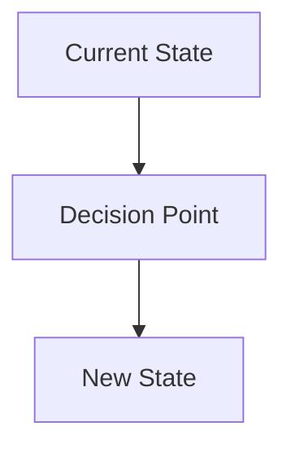

# ADR-[NUMBER]: [Title]

Date: [YYYY-MM-DD]

## Status

[Proposed | Accepted | Deprecated | Superseded]

## Context

What is the issue that we're seeing that is motivating this decision or change? Describe the context and problem statement. Include any relevant background information, constraints, or requirements that influence this decision.

### Current Situation
- What is the current state?
- What are the pain points?
- What are the limitations?

### Requirements
- What are the functional requirements?
- What are the non-functional requirements (performance, security, maintainability)?
- What are the constraints (time, resources, technology)?

## Decision

What is the change that we're proposing and/or doing? State the decision clearly and concisely.

### Chosen Solution
Describe the solution that was selected.

### Implementation Approach
High-level overview of how this will be implemented.

## Consequences

What becomes easier or more difficult to do because of this change?

### Positive Consequences
- What improves?
- What becomes possible?
- What risks are mitigated?

### Negative Consequences
- What becomes more complex?
- What trade-offs are we making?
- What technical debt might we incur?

### Risks and Mitigations
| Risk | Probability | Impact | Mitigation |
|------|------------|--------|------------|
| [Risk description] | Low/Medium/High | Low/Medium/High | [How to mitigate] |

## Alternatives Considered

What other options were considered? Why were they rejected?

### Option 1: [Name]
- **Description**: Brief description of the alternative
- **Pros**: 
  - Advantage 1
  - Advantage 2
- **Cons**:
  - Disadvantage 1
  - Disadvantage 2
- **Reason for rejection**: Why this wasn't chosen

### Option 2: [Name]
- **Description**: Brief description of the alternative
- **Pros**: 
  - Advantage 1
  - Advantage 2
- **Cons**:
  - Disadvantage 1
  - Disadvantage 2
- **Reason for rejection**: Why this wasn't chosen

## Decision Criteria

What criteria were used to make this decision?

1. **[Criterion 1]**: Why this matters
2. **[Criterion 2]**: Why this matters
3. **[Criterion 3]**: Why this matters

## Implementation Plan

### Phase 1: [Name] (Timeline)
- [ ] Task 1
- [ ] Task 2
- [ ] Task 3

### Phase 2: [Name] (Timeline)
- [ ] Task 1
- [ ] Task 2

### Dependencies
- What needs to be in place before implementation?
- What other decisions does this depend on?

## Validation

How will we know if this decision was successful?

### Success Metrics
- Metric 1: Target value
- Metric 2: Target value
- Metric 3: Target value

### Validation Approach
- How will we measure success?
- When will we evaluate the decision?
- What would trigger a re-evaluation?

## References

- [Link to relevant documentation]
- [Link to similar decisions in other projects]
- [Link to technology documentation]
- [Link to team discussions]

## Appendix

### Detailed Analysis
[Any detailed analysis, benchmarks, or supporting data]

### Code Examples
```python
# Example code demonstrating the approach
```

### Diagrams


---

## Review History

| Date | Reviewer | Status | Comments |
|------|----------|--------|----------|
| [YYYY-MM-DD] | [Name] | [Status] | [Comments] |

## Related ADRs

- [ADR-XXX](./ADR-XXX-title.md) - How this relates
- [ADR-YYY](./ADR-YYY-title.md) - How this relates