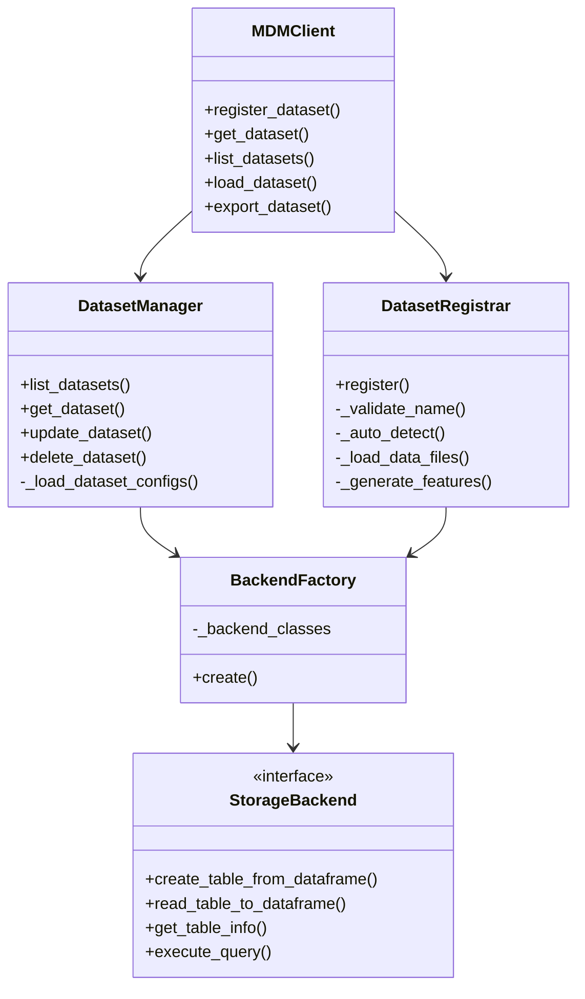
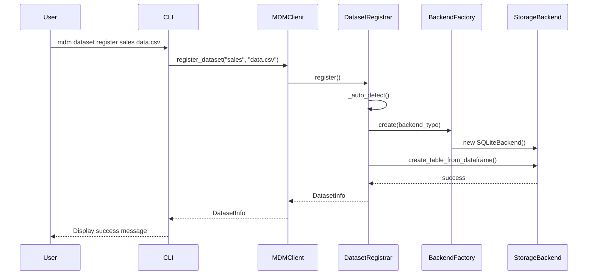
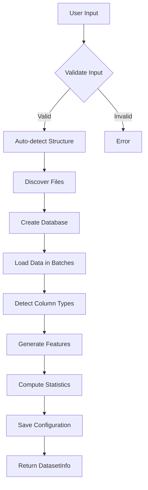
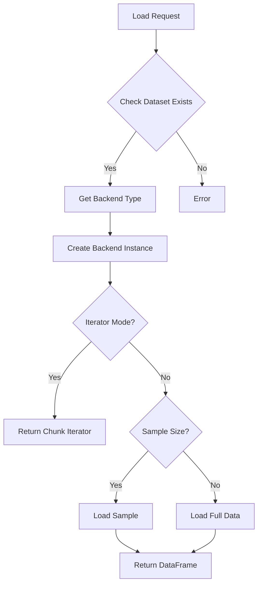
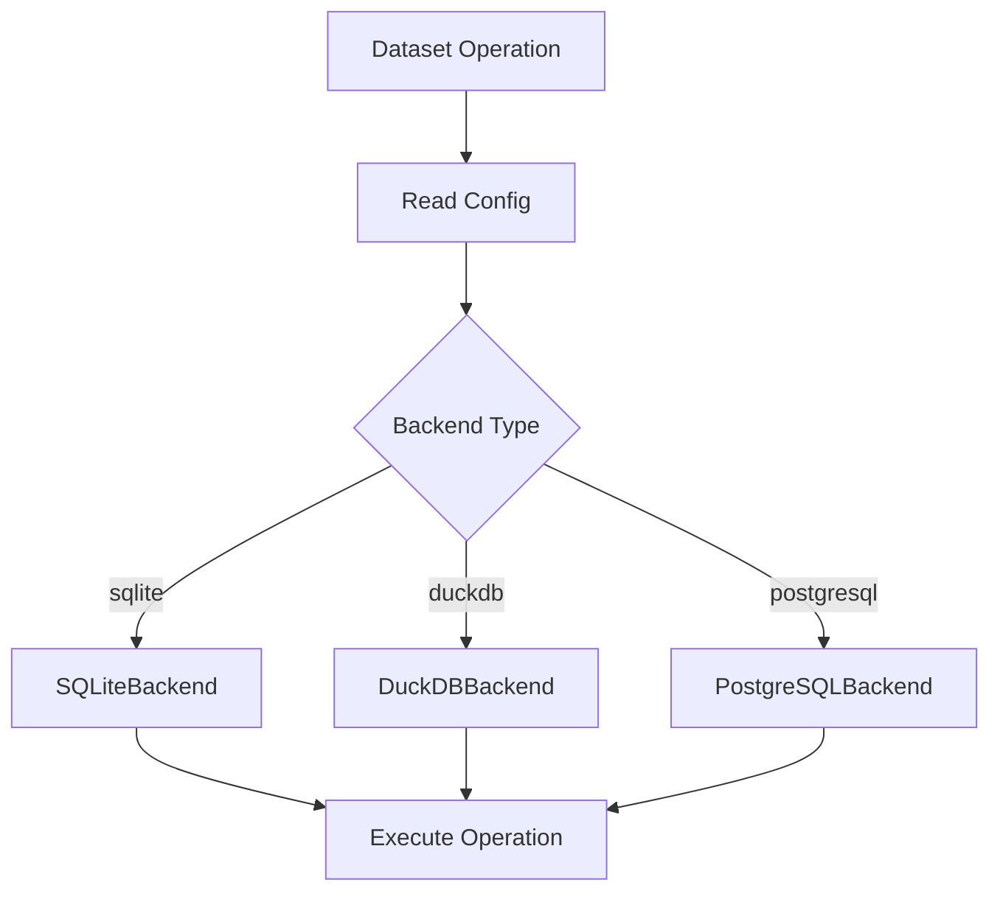
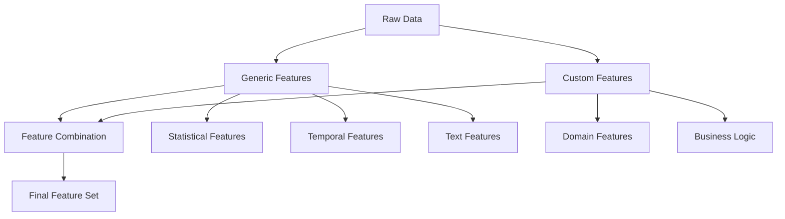
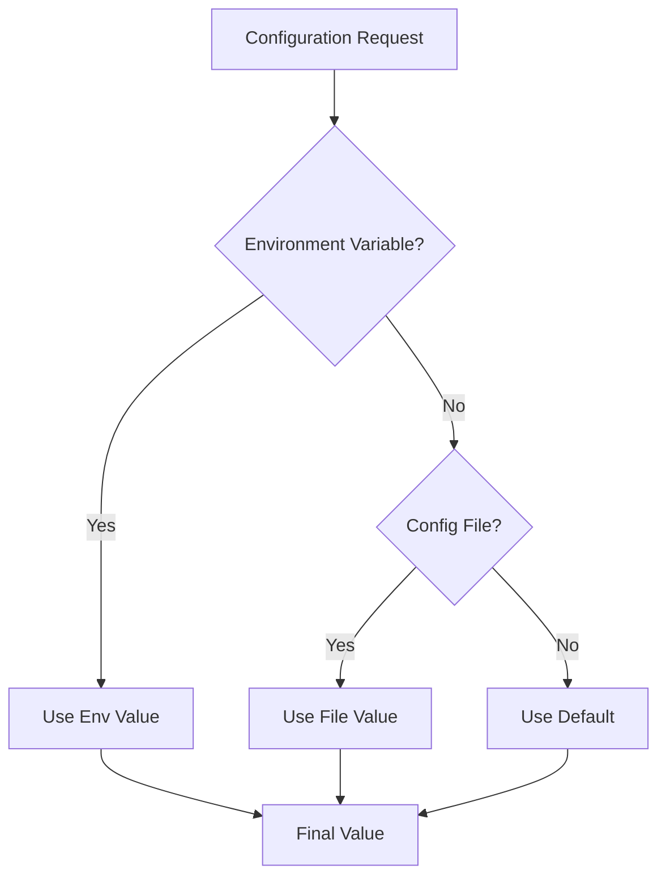
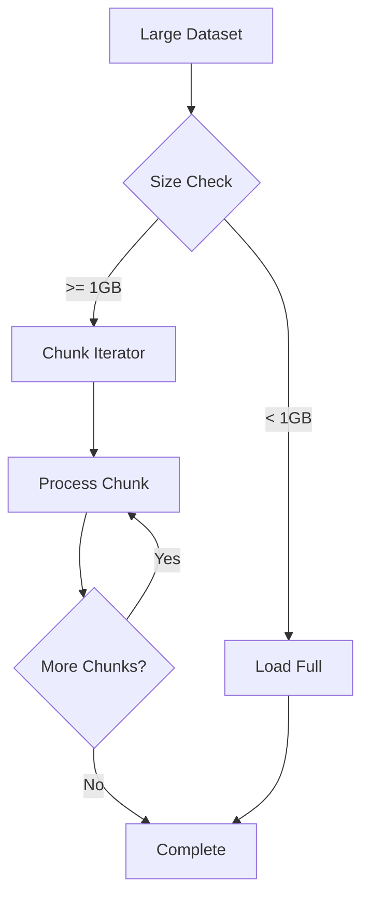

# MDM Architecture & Design

## Table of Contents
1. [System Architecture](#system-architecture)
2. [Component Design](#component-design)
3. [Data Flow](#data-flow)
4. [Storage Architecture](#storage-architecture)
5. [Feature Engineering Architecture](#feature-engineering-architecture)
6. [Configuration Architecture](#configuration-architecture)
7. [Security & Performance](#security--performance)
8. [Extension Points](#extension-points)

## System Architecture

### Overview

MDM follows a layered architecture pattern with clear separation of concerns:

```
┌─────────────────────────────────────────────────────┐
│                   CLI Layer                         │
│  (Typer + Rich for command-line interface)         │
├─────────────────────────────────────────────────────┤
│                   API Layer                         │
│  (MDMClient - public programmatic interface)       │
├─────────────────────────────────────────────────────┤
│                Business Logic Layer                 │
│  (DatasetManager, DatasetRegistrar, Exporters)     │
├─────────────────────────────────────────────────────┤
│              Storage Abstraction Layer              │
│  (StorageBackend interface, BackendFactory)        │
├─────────────────────────────────────────────────────┤
│                 Storage Backends                    │
│  (SQLite, DuckDB, PostgreSQL implementations)      │
└─────────────────────────────────────────────────────┘
```

### Design Principles

1. **Separation of Concerns**: Each layer has a specific responsibility
2. **Dependency Injection**: Components receive dependencies rather than creating them
3. **Interface Segregation**: Small, focused interfaces for each component
4. **Open/Closed Principle**: Open for extension (new backends), closed for modification
5. **Single Responsibility**: Each class has one reason to change

## Component Design

### Core Components



### Component Interactions



## Data Flow

### Registration Flow



### Data Loading Flow



## Storage Architecture

### Database Structure

Each dataset has its own database with standardized tables:

```sql
-- Main data tables
CREATE TABLE train_table (
    -- Original columns from source data
    id INTEGER,
    feature1 REAL,
    feature2 TEXT,
    target INTEGER,
    -- Generated feature columns
    feature1_mean_encoded REAL,
    feature2_length INTEGER
);

CREATE TABLE test_table (
    -- Same structure as train_table
);

-- Metadata table
CREATE TABLE _mdm_metadata (
    key TEXT PRIMARY KEY,
    value TEXT,
    created_at TIMESTAMP,
    updated_at TIMESTAMP
);

-- Feature metadata
CREATE TABLE _mdm_features (
    feature_name TEXT PRIMARY KEY,
    source_column TEXT,
    transformer_type TEXT,
    parameters TEXT,  -- JSON
    created_at TIMESTAMP
);
```

### Backend Abstraction

```python
class StorageBackend(ABC):
    """Abstract base class for storage backends."""
    
    @abstractmethod
    def get_engine(self, connection_string: str) -> Any:
        """Get SQLAlchemy engine."""
        pass
    
    @abstractmethod
    def create_table_from_dataframe(
        self,
        df: pd.DataFrame,
        table_name: str,
        engine: Any,
        if_exists: str = 'replace',
        index: bool = False,
        dtype: Optional[Dict[str, Any]] = None
    ) -> None:
        """Create table from pandas DataFrame."""
        pass
    
    @abstractmethod
    def read_table_to_dataframe(
        self,
        table_name: str,
        engine: Any,
        columns: Optional[List[str]] = None,
        limit: Optional[int] = None,
        offset: int = 0
    ) -> pd.DataFrame:
        """Read table into pandas DataFrame."""
        pass
```

### Backend Selection



## Feature Engineering Architecture

### Two-Tier System



### Feature Generation Pipeline

```python
class FeatureGenerator:
    def __init__(self):
        self.generic_transformers = self._load_generic_transformers()
        self.custom_transformers = self._load_custom_transformers()
    
    def generate(
        self,
        df: pd.DataFrame,
        column_types: Dict[str, ColumnType],
        target_column: Optional[str] = None
    ) -> pd.DataFrame:
        # Apply generic transformers
        for transformer in self.generic_transformers:
            if transformer.can_handle(column_types):
                df = transformer.transform(df)
        
        # Apply custom transformers
        for transformer in self.custom_transformers:
            df = transformer.transform(df)
        
        return df
```

### Transformer Interface

```python
class BaseTransformer(ABC):
    """Base class for feature transformers."""
    
    @abstractmethod
    def fit(self, df: pd.DataFrame) -> 'BaseTransformer':
        """Fit transformer to data."""
        pass
    
    @abstractmethod
    def transform(self, df: pd.DataFrame) -> pd.DataFrame:
        """Transform data."""
        pass
    
    def fit_transform(self, df: pd.DataFrame) -> pd.DataFrame:
        """Fit and transform in one step."""
        return self.fit(df).transform(df)
```

## Configuration Architecture

### Configuration Hierarchy



### Configuration Model

```python
class MDMConfig(BaseSettings):
    """Main configuration model using Pydantic."""
    
    database: DatabaseConfig = DatabaseConfig()
    performance: PerformanceConfig = PerformanceConfig()
    features: FeaturesConfig = FeaturesConfig()
    logging: LoggingConfig = LoggingConfig()
    paths: PathsConfig = PathsConfig()
    
    class Config:
        env_prefix = "MDM_"
        env_nested_delimiter = "_"
        case_sensitive = False

class DatabaseConfig(BaseModel):
    default_backend: str = "sqlite"
    sqlite: SQLiteConfig = SQLiteConfig()
    duckdb: DuckDBConfig = DuckDBConfig()
    postgresql: PostgreSQLConfig = PostgreSQLConfig()
```

### Environment Variable Mapping

```
MDM_DATABASE_DEFAULT_BACKEND=postgresql
MDM_DATABASE_POSTGRESQL_HOST=localhost
MDM_DATABASE_POSTGRESQL_PORT=5432
MDM_PERFORMANCE_BATCH_SIZE=50000
MDM_LOGGING_LEVEL=DEBUG
```

## Security & Performance

### Security Considerations

1. **Input Validation**: All user inputs validated with Pydantic
2. **SQL Injection Prevention**: Use parameterized queries via SQLAlchemy
3. **File Access Control**: Validate file paths, prevent directory traversal
4. **Sensitive Data**: No credentials in logs, use environment variables
5. **Error Messages**: Generic errors for users, detailed logs for debugging

### Performance Optimizations

1. **Batch Processing**
   ```python
   # Load data in chunks
   for chunk in pd.read_csv(file_path, chunksize=10000):
       process_chunk(chunk)
   ```

2. **Connection Pooling**
   ```python
   # SQLAlchemy connection pool
   engine = create_engine(
       connection_string,
       pool_size=5,
       max_overflow=10,
       pool_pre_ping=True
   )
   ```

3. **Lazy Loading**
   ```python
   # Load only requested columns
   df = backend.read_table_to_dataframe(
       table_name,
       columns=['id', 'amount']
   )
   ```

4. **Index Optimization**
   ```python
   # Create indexes on frequently queried columns
   backend.create_index(table_name, ['id', 'created_at'])
   ```

### Memory Management



## Extension Points

### Adding New Storage Backend

1. Create new backend class:
```python
# src/mdm/storage/mongodb.py
from mdm.storage.base import StorageBackend

class MongoDBBackend(StorageBackend):
    def __init__(self, config: Dict[str, Any]):
        self.client = MongoClient(**config)
    
    def create_table_from_dataframe(self, df, table_name, ...):
        # Implementation
        pass
```

2. Register in BackendFactory:
```python
# src/mdm/storage/factory.py
class BackendFactory:
    _backends = {
        'sqlite': SQLiteBackend,
        'duckdb': DuckDBBackend,
        'postgresql': PostgreSQLBackend,
        'mongodb': MongoDBBackend  # Add here
    }
```

3. Add configuration:
```python
# src/mdm/config.py
class MongoDBConfig(BaseModel):
    host: str = "localhost"
    port: int = 27017
    database: str = "mdm"
```

### Adding New Feature Transformers

1. Create transformer class:
```python
# ~/.mdm/config/custom_features/time_features.py
from mdm.features.base import BaseTransformer

class TimeSeriesFeatures(BaseTransformer):
    def transform(self, df: pd.DataFrame) -> pd.DataFrame:
        # Add rolling statistics
        for col in df.select_dtypes(include=[np.number]).columns:
            df[f'{col}_rolling_mean_7'] = df[col].rolling(7).mean()
            df[f'{col}_rolling_std_7'] = df[col].rolling(7).std()
        return df
```

2. Transformer is automatically loaded from custom features directory

### Adding New CLI Commands

1. Create command module:
```python
# src/mdm/cli/analyze.py
from typer import Typer

app = Typer()

@app.command()
def quality(dataset_name: str):
    """Analyze dataset quality."""
    # Implementation
```

2. Register in main CLI:
```python
# src/mdm/cli/main.py
from mdm.cli import analyze

app.add_typer(analyze.app, name="analyze")
```

### Integration Points

1. **ML Frameworks**: Load data directly into framework formats
2. **Data Catalogs**: Export metadata for data catalogs
3. **Monitoring**: Export metrics for monitoring systems
4. **CI/CD**: Automated dataset validation in pipelines

## Deployment Considerations

### Single User Deployment
```yaml
# ~/.mdm/mdm.yaml
database:
  default_backend: sqlite
paths:
  base_path: ~/.mdm
```

### Team Deployment
```yaml
# ~/.mdm/mdm.yaml
database:
  default_backend: postgresql
  postgresql:
    host: shared-db.company.com
    port: 5432
    database: mdm_prod
```

### Docker Deployment
```dockerfile
FROM python:3.11-slim
RUN pip install mdm
ENV MDM_DATABASE_DEFAULT_BACKEND=postgresql
ENV MDM_DATABASE_POSTGRESQL_HOST=db
CMD ["mdm", "serve"]  # Future API server
```