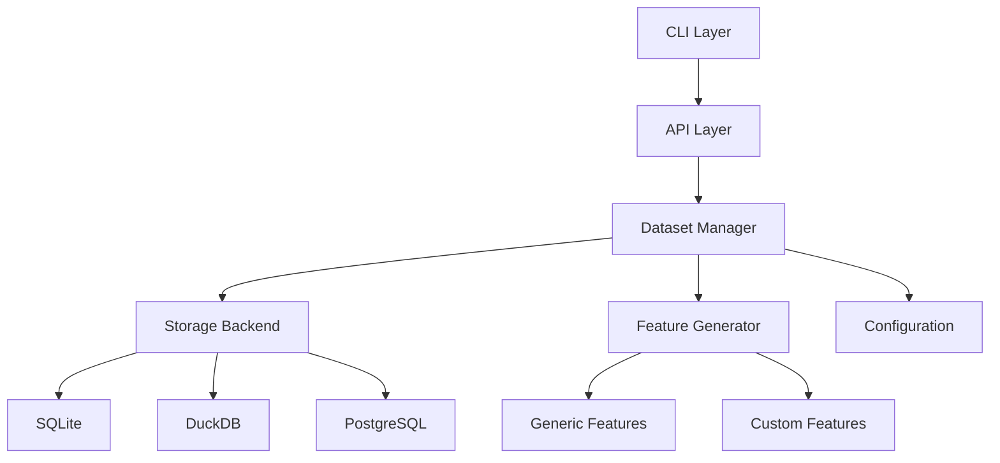

# MDM Developer Guide

## Table of Contents
1. [Getting Started](#getting-started)
2. [Architecture Overview](#architecture-overview)
3. [Core Components](#core-components)
4. [Storage Backends](#storage-backends)
5. [Dataset Management](#dataset-management)
6. [Feature Engineering](#feature-engineering)
7. [Configuration System](#configuration-system)
8. [CLI Development](#cli-development)
9. [Testing Guide](#testing-guide)
10. [Contributing](#contributing)

## Getting Started

### Prerequisites
- Python 3.9 or higher
- uv (recommended) or pip
- SQLite3 (included with Python)
- Optional: PostgreSQL for production deployments

### Development Setup

```bash
# Clone the repository
git clone <repository-url>
cd mdm

# Create virtual environment using uv
uv venv
source .venv/bin/activate

# Install in development mode
uv pip install -e .

# Install development dependencies
uv pip install -e ".[dev]"

# Run tests to verify setup
./scripts/run_tests.sh --unit-only
```

### Project Structure

```
mdm/
├── src/mdm/
│   ├── api.py              # Public API (MDMClient)
│   ├── cli/                # CLI implementation
│   │   ├── main.py         # Main CLI entry point
│   │   ├── dataset.py      # Dataset commands
│   │   └── batch.py        # Batch operations
│   ├── config.py           # Configuration management
│   ├── core/               # Core data models
│   │   ├── models.py       # Pydantic models
│   │   └── exceptions.py   # Custom exceptions
│   ├── dataset/            # Dataset management
│   │   ├── manager.py      # Dataset operations
│   │   ├── registrar.py    # Registration logic
│   │   └── exporter.py     # Export functionality
│   ├── features/           # Feature engineering
│   │   ├── generator.py    # Feature generation
│   │   └── transformers/   # Feature transformers
│   └── storage/            # Storage backends
│       ├── base.py         # Abstract backend
│       ├── sqlite.py       # SQLite implementation
│       └── duckdb.py       # DuckDB implementation
├── tests/                  # Test suite
├── docs/                   # Documentation
└── scripts/                # Utility scripts
```

## Architecture Overview

MDM follows a modular architecture with clear separation of concerns:



### Design Principles

1. **Single Backend Architecture**: All datasets use the same storage backend type
2. **Decentralized Storage**: Each dataset has its own database
3. **Batch Processing**: Memory-efficient handling of large datasets
4. **Extensible Features**: Two-tier feature engineering system
5. **Rich CLI**: User-friendly interface with progress tracking

## Core Components

### DatasetManager

The `DatasetManager` is the central component for dataset operations:

```python
from mdm.dataset.manager import DatasetManager

# Initialize manager
manager = DatasetManager()

# List datasets
datasets = manager.list_datasets()

# Get dataset info
info = manager.get_dataset("my_dataset")

# Update dataset metadata
manager.update_dataset(
    "my_dataset",
    description="Updated description",
    tags=["ml", "classification"]
)
```

### DatasetRegistrar

Handles the complex process of dataset registration:

```python
from mdm.dataset.registrar import DatasetRegistrar

registrar = DatasetRegistrar()

# Register a new dataset
dataset_info = registrar.register(
    name="sales_data",
    dataset_path="/path/to/data.csv",
    target_column="revenue",
    problem_type="regression",
    generate_features=True
)
```

### Configuration Management

MDM uses Pydantic Settings for configuration:

```python
from mdm.config import get_config_manager

# Get configuration
config_manager = get_config_manager()
config = config_manager.config

# Access settings
batch_size = config.performance.batch_size
backend = config.database.default_backend
```

## Storage Backends

### Backend Interface

All storage backends implement the `StorageBackend` abstract class:

```python
from abc import ABC, abstractmethod
from typing import Dict, Any, List
import pandas as pd

class StorageBackend(ABC):
    @abstractmethod
    def create_table_from_dataframe(
        self, 
        df: pd.DataFrame, 
        table_name: str,
        if_exists: str = 'replace'
    ) -> None:
        """Create table from DataFrame."""
        pass
    
    @abstractmethod
    def read_table_to_dataframe(
        self,
        table_name: str,
        columns: List[str] = None,
        limit: int = None
    ) -> pd.DataFrame:
        """Read table into DataFrame."""
        pass
```

### Implementing a New Backend

To add a new storage backend:

1. Create a new file in `src/mdm/storage/`
2. Implement the `StorageBackend` interface
3. Register in `BackendFactory`

Example:
```python
# src/mdm/storage/mongodb.py
from mdm.storage.base import StorageBackend

class MongoDBBackend(StorageBackend):
    def __init__(self, connection_params: Dict[str, Any]):
        self.client = pymongo.MongoClient(**connection_params)
        self.db = self.client.mdm
    
    def create_table_from_dataframe(self, df, table_name, if_exists='replace'):
        collection = self.db[table_name]
        if if_exists == 'replace':
            collection.drop()
        records = df.to_dict('records')
        collection.insert_many(records)
```

## Dataset Management

### Registration Process

The registration process follows these steps:

1. **Validation**: Check name and path validity
2. **Auto-detection**: Detect file structure and format
3. **File Discovery**: Find train/test/validation files
4. **Database Creation**: Initialize storage backend
5. **Data Loading**: Load data in batches
6. **Column Analysis**: Detect types and statistics
7. **Feature Generation**: Create engineered features
8. **Metadata Storage**: Save configuration

### Batch Processing

Large datasets are processed in chunks:

```python
def _load_data_files(self, files: Dict[str, Path], db_info: Dict[str, Any]):
    batch_size = self.config.performance.batch_size
    
    for file_type, file_path in files.items():
        # Read file in chunks
        for chunk_num, chunk in enumerate(
            pd.read_csv(file_path, chunksize=batch_size)
        ):
            # Process chunk
            if chunk_num == 0:
                backend.create_table_from_dataframe(
                    chunk, table_name, if_exists='replace'
                )
            else:
                backend.create_table_from_dataframe(
                    chunk, table_name, if_exists='append'
                )
```

## Feature Engineering

### Two-Tier System

MDM uses a two-tier feature engineering system:

1. **Generic Features**: Statistical, temporal, and text features
2. **Custom Features**: User-defined transformations

### Creating Custom Features

Place custom feature files in `~/.mdm/config/custom_features/`:

```python
# ~/.mdm/config/custom_features/sales_features.py
import pandas as pd
from mdm.features.base import BaseTransformer

class SeasonalityTransformer(BaseTransformer):
    """Extract seasonality features from date columns."""
    
    def fit(self, df: pd.DataFrame) -> 'SeasonalityTransformer':
        return self
    
    def transform(self, df: pd.DataFrame) -> pd.DataFrame:
        for col in df.select_dtypes(include=['datetime64']).columns:
            df[f'{col}_quarter'] = df[col].dt.quarter
            df[f'{col}_month'] = df[col].dt.month
            df[f'{col}_dayofweek'] = df[col].dt.dayofweek
        return df
```

## Configuration System

### Configuration Hierarchy

1. **Code Defaults**: Built-in defaults
2. **YAML File**: `~/.mdm/mdm.yaml`
3. **Environment Variables**: Highest priority

### Environment Variables

Pattern: `MDM_<SECTION>_<KEY>`

```bash
# Set backend
export MDM_DATABASE_DEFAULT_BACKEND=postgresql

# Configure performance
export MDM_PERFORMANCE_BATCH_SIZE=50000
export MDM_PERFORMANCE_MAX_CONCURRENT_OPERATIONS=8

# Set logging
export MDM_LOGGING_LEVEL=DEBUG
export MDM_LOGGING_FILE=/var/log/mdm.log
```

## CLI Development

### Adding New Commands

Use Typer to add new CLI commands:

```python
# src/mdm/cli/dataset.py
from typer import Typer, Option
from rich.console import Console

app = Typer()
console = Console()

@app.command()
def analyze(
    name: str = Argument(..., help="Dataset name"),
    output: Path = Option(None, "--output", "-o", help="Output file")
):
    """Analyze dataset quality and statistics."""
    try:
        # Implementation
        client = MDMClient()
        analysis = client.analyze_dataset(name)
        
        if output:
            analysis.to_json(output)
        else:
            console.print(analysis)
    except DatasetError as e:
        console.print(f"[red]Error:[/red] {e}")
        raise typer.Exit(1)
```

### Progress Tracking

Use Rich Progress for long operations:

```python
from rich.progress import Progress, SpinnerColumn, TextColumn

with Progress(
    SpinnerColumn(),
    TextColumn("[progress.description]{task.description}"),
    transient=True
) as progress:
    task = progress.add_task("Processing...", total=None)
    
    for item in items:
        progress.update(task, description=f"Processing {item}")
        # Process item
```

## Testing Guide

### Test Structure

```
tests/
├── unit/           # Unit tests
├── integration/    # Integration tests
├── e2e/           # End-to-end tests
└── fixtures/      # Test fixtures
```

### Writing Tests

Follow these patterns:

```python
# tests/unit/dataset/test_manager.py
import pytest
from unittest.mock import Mock, patch
from mdm.dataset.manager import DatasetManager

class TestDatasetManager:
    @pytest.fixture
    def manager(self):
        with patch('mdm.config.get_config_manager') as mock_config:
            # Setup mock configuration
            mock_config.return_value.config = Mock()
            return DatasetManager()
    
    def test_list_datasets(self, manager):
        # Arrange
        with patch.object(manager, '_load_dataset_configs') as mock_load:
            mock_load.return_value = [
                {'name': 'dataset1'},
                {'name': 'dataset2'}
            ]
            
            # Act
            datasets = manager.list_datasets()
            
            # Assert
            assert len(datasets) == 2
            assert datasets[0]['name'] == 'dataset1'
```

### Running Tests

```bash
# Run all tests
./scripts/run_tests.sh

# Run with coverage
./scripts/run_tests.sh --coverage

# Run specific test
pytest tests/unit/dataset/test_manager.py::TestDatasetManager::test_list_datasets -v

# Run with debugging
pytest tests/unit/dataset/test_manager.py -v -s --pdb
```

## Contributing

### Code Style

- Use Black for formatting (line length: 100)
- Use Ruff for linting
- Type hints for all public functions
- Docstrings in Google style

### Pre-commit Checks

```bash
# Format code
black src/ tests/ --line-length 100

# Lint
ruff check src/

# Type check
mypy src/mdm

# Check test imports
./scripts/check_test_imports.py
```

### Pull Request Process

1. Create feature branch from `main`
2. Write tests for new functionality
3. Ensure all tests pass
4. Update documentation
5. Submit PR with clear description

### Common Patterns

- Use dependency injection for testability
- Batch process large operations
- Log at appropriate levels
- Handle errors gracefully
- Use Rich for CLI output