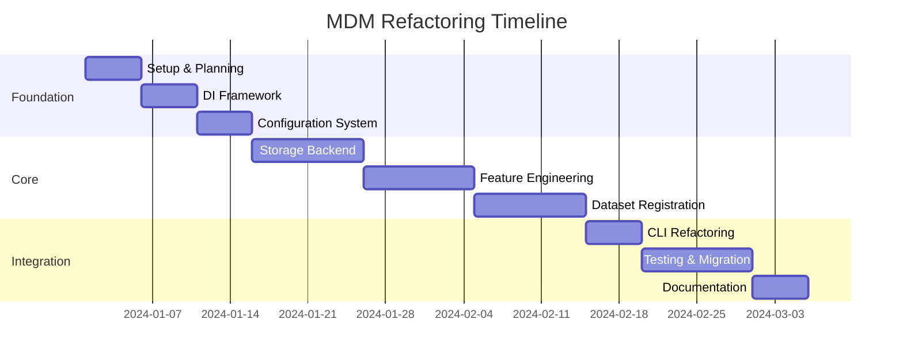

# MDM Migration Roadmap

## Executive Summary

This roadmap provides a detailed, week-by-week implementation plan for refactoring MDM from its current monolithic architecture to a clean, modular system. The migration is designed to be incremental, testable, and reversible.

## Timeline Overview

**Total Duration**: 10 weeks
**Team Size**: 2-3 developers
**Risk Level**: Medium (mitigated through incremental approach)



## Week 1-2: Foundation Phase

### Week 1: Project Setup and Planning

#### Monday-Tuesday: Project Initialization
```bash
# Create refactoring branch
git checkout -b refactoring/clean-architecture

# Set up new project structure
mkdir -p src/mdm/{domain,application,infrastructure,presentation}
mkdir -p src/mdm/infrastructure/{storage,config,features}
mkdir -p docs/refactoring/{completed,in-progress,planned}
```

#### Wednesday-Thursday: Dependency Injection Framework
```python
# src/mdm/infrastructure/container.py
from typing import Dict, Type, Any, Callable
import inspect

class Container:
    """Dependency injection container."""
    
    def __init__(self):
        self._services: Dict[Type, Any] = {}
        self._factories: Dict[Type, Callable] = {}
        self._scopes: Dict[Type, str] = {}
    
    def register_singleton(self, interface: Type, implementation: Any) -> None:
        """Register singleton service."""
        self._services[interface] = implementation
        self._scopes[interface] = "singleton"
    
    def register_transient(self, interface: Type, factory: Callable) -> None:
        """Register transient service."""
        self._factories[interface] = factory
        self._scopes[interface] = "transient"
    
    def resolve(self, interface: Type) -> Any:
        """Resolve service with dependencies."""
        if interface in self._services:
            return self._services[interface]
        
        if interface in self._factories:
            factory = self._factories[interface]
            # Auto-inject dependencies
            return self._inject_dependencies(factory)
        
        raise ValueError(f"Service not registered: {interface}")
    
    def _inject_dependencies(self, factory: Callable) -> Any:
        """Inject dependencies into factory."""
        sig = inspect.signature(factory)
        kwargs = {}
        
        for param_name, param in sig.parameters.items():
            if param.annotation != param.empty:
                kwargs[param_name] = self.resolve(param.annotation)
        
        return factory(**kwargs)
```

#### Friday: Configuration System Foundation
```python
# src/mdm/infrastructure/config/settings.py
from pydantic import BaseSettings, Field
from pathlib import Path
from typing import Optional, List, Dict, Any

class MDMSettings(BaseSettings):
    """Central configuration settings."""
    
    # Application
    app_name: str = Field(default="mdm", env="MDM_APP_NAME")
    version: str = Field(default="2.0.0", env="MDM_VERSION")
    
    # Storage
    storage_backend: str = Field(
        default="sqlite",
        env="MDM_STORAGE_BACKEND",
        description="Storage backend type"
    )
    
    # Performance
    batch_size: int = Field(
        default=10000,
        env="MDM_BATCH_SIZE",
        ge=100,
        le=1000000
    )
    
    # Paths
    base_path: Path = Field(
        default=Path("~/.mdm"),
        env="MDM_BASE_PATH"
    )
    
    class Config:
        env_file = ".env"
        case_sensitive = False
```

### Week 2: Configuration and Path Management

#### Monday-Tuesday: Configuration Manager
```python
# src/mdm/infrastructure/config/manager.py
class ConfigurationManager:
    """Manages configuration lifecycle."""
    
    def __init__(self, config_path: Optional[Path] = None):
        self.config_path = config_path or self._default_config_path()
        self._settings: Optional[MDMSettings] = None
        self._validators: List[ConfigValidator] = []
    
    def load(self) -> MDMSettings:
        """Load configuration from all sources."""
        # Implementation from design doc
        pass
    
    def add_validator(self, validator: ConfigValidator) -> None:
        """Add configuration validator."""
        self._validators.append(validator)
    
    def validate(self) -> List[str]:
        """Validate configuration."""
        errors = []
        settings = self.get()
        
        for validator in self._validators:
            errors.extend(validator.validate(settings))
        
        return errors
```

#### Wednesday-Thursday: Path Management System
```python
# src/mdm/infrastructure/paths.py
class PathManager:
    """Centralized path management."""
    
    def __init__(self, settings: MDMSettings):
        self.settings = settings
        self._ensure_structure()
    
    def dataset_path(self, name: str) -> Path:
        """Get dataset directory path."""
        return self.datasets_path / name
    
    def _ensure_structure(self) -> None:
        """Ensure directory structure exists."""
        for path in self._get_required_paths():
            path.mkdir(parents=True, exist_ok=True)
```

#### Friday: Integration and Testing
- Write comprehensive tests for DI container
- Test configuration loading hierarchy
- Verify path management works correctly

## Week 3-4: Storage Backend Refactoring

### Week 3: Backend Architecture

#### Monday-Tuesday: Storage Interfaces
```python
# src/mdm/domain/storage/interfaces.py
from typing import Protocol, Optional, List, Any
import pandas as pd

class Connection(Protocol):
    """Database connection protocol."""
    
    def execute(self, query: str, params: Optional[List[Any]] = None) -> Any:
        """Execute query."""
        ...
    
    def commit(self) -> None:
        """Commit transaction."""
        ...
    
    def rollback(self) -> None:
        """Rollback transaction."""
        ...

class StorageBackend(Protocol):
    """Storage backend protocol."""
    
    def create_table(
        self, 
        conn: Connection,
        table_name: str,
        df: pd.DataFrame,
        **kwargs
    ) -> None:
        """Create table from dataframe."""
        ...
```

#### Wednesday-Thursday: Connection Management
```python
# src/mdm/infrastructure/storage/connection.py
from contextlib import contextmanager
from typing import Iterator

class ConnectionPool:
    """Database connection pool."""
    
    def __init__(self, config: ConnectionConfig):
        self.config = config
        self._pool: List[Connection] = []
        self._init_pool()
    
    @contextmanager
    def get_connection(self) -> Iterator[Connection]:
        """Get connection from pool."""
        conn = self._acquire()
        try:
            yield conn
        finally:
            self._release(conn)
```

#### Friday: SQLite Backend Implementation
```python
# src/mdm/infrastructure/storage/backends/sqlite.py
class SQLiteBackend:
    """SQLite storage implementation."""
    
    def create_table(
        self,
        conn: Connection,
        table_name: str,
        df: pd.DataFrame,
        if_exists: str = 'replace'
    ) -> None:
        """Create table from dataframe."""
        # Stateless implementation
        pass
```

### Week 4: Backend Migration

#### Monday-Tuesday: Adapter Pattern
```python
# src/mdm/infrastructure/storage/adapter.py
class LegacyBackendAdapter:
    """Adapts new backend to old interface."""
    
    def __init__(
        self,
        backend: StorageBackend,
        conn_manager: ConnectionManager
    ):
        self.backend = backend
        self.conn_manager = conn_manager
    
    def get_engine(self, database_path: str):
        """Legacy method for compatibility."""
        warnings.warn(
            "get_engine is deprecated, use ConnectionManager",
            DeprecationWarning
        )
        # Return compatible object
```

#### Wednesday-Thursday: Migration Testing
- Parallel testing of old vs new implementation
- Performance benchmarking
- Data integrity verification

#### Friday: Rollout Preparation
- Feature flags for backend selection
- Documentation updates
- Team training

## Week 5-6: Feature Engineering System

### Week 5: Feature Pipeline Architecture

#### Monday-Tuesday: Pipeline Framework
```python
# src/mdm/domain/features/pipeline.py
class FeaturePipeline:
    """Feature transformation pipeline."""
    
    def __init__(self):
        self.transformers: List[FeatureTransformer] = []
        self.hooks: Dict[str, List[Callable]] = defaultdict(list)
    
    def add_transformer(self, transformer: FeatureTransformer) -> 'FeaturePipeline':
        """Add transformer to pipeline."""
        self.transformers.append(transformer)
        return self
    
    def execute(self, df: pd.DataFrame, context: FeatureContext) -> pd.DataFrame:
        """Execute pipeline."""
        # Implementation with hooks
        pass
```

#### Wednesday-Thursday: Core Transformers
```python
# src/mdm/infrastructure/features/transformers/statistical.py
class StatisticalTransformer:
    """Statistical feature transformer."""
    
    def transform(self, df: pd.DataFrame, context: FeatureContext) -> pd.DataFrame:
        """Add statistical features."""
        # Clean implementation
        pass
```

#### Friday: Plugin System
```python
# src/mdm/infrastructure/features/plugins.py
class FeaturePluginManager:
    """Manages feature plugins."""
    
    def discover_plugins(self) -> Dict[str, Type[FeatureTransformer]]:
        """Discover and load plugins."""
        # Plugin discovery implementation
        pass
```

### Week 6: Feature System Migration

#### Monday-Tuesday: Migration Adapter
- Create adapter for old FeatureGenerator interface
- Ensure backward compatibility

#### Wednesday-Thursday: Testing
- Unit tests for all transformers
- Integration tests for pipeline
- Performance benchmarking

#### Friday: Documentation
- Plugin development guide
- Migration guide for custom features

## Week 7-8: Dataset Registration Refactoring

### Week 7: Registration Pipeline

#### Monday-Tuesday: Step Interface
```python
# src/mdm/domain/dataset/steps.py
class RegistrationStep(ABC):
    """Base class for registration steps."""
    
    @abstractmethod
    def execute(self, context: RegistrationContext) -> StepResult:
        """Execute registration step."""
        pass
    
    @abstractmethod
    def rollback(self, context: RegistrationContext) -> None:
        """Rollback step changes."""
        pass
```

#### Wednesday-Thursday: Core Steps
- Implement validation steps
- Implement file discovery steps
- Implement database creation steps

#### Friday: Pipeline Implementation
```python
# src/mdm/application/dataset/pipeline.py
class RegistrationPipeline:
    """Dataset registration pipeline."""
    
    def execute(self, context: RegistrationContext) -> RegistrationContext:
        """Execute registration with rollback support."""
        # Transaction-like implementation
        pass
```

### Week 8: Registration Migration

#### Monday-Tuesday: Refactor DatasetRegistrar
- Break up god class
- Implement using new pipeline

#### Wednesday-Thursday: Progress Tracking
- Separate progress tracking from business logic
- Implement clean progress hooks

#### Friday: Testing and Documentation
- Comprehensive test suite
- Migration documentation

## Week 9-10: Integration and Rollout

### Week 9: Final Integration

#### Monday-Tuesday: CLI Refactoring
```python
# src/mdm/presentation/cli/commands/dataset.py
@app.command()
def register(
    # Use injected services
    dataset_service: Annotated[DatasetService, Depends(get_dataset_service)],
    name: str = Argument(...),
    path: Path = Argument(...)
):
    """Register dataset using clean architecture."""
    dataset_service.register(name, path)
```

#### Wednesday-Thursday: API Layer
- Create clean API using new architecture
- Ensure backward compatibility

#### Friday: System Integration Testing
- Full end-to-end testing
- Performance validation

### Week 10: Rollout and Documentation

#### Monday-Tuesday: Gradual Rollout
```python
# Feature flag configuration
feature_flags:
  new_storage_backend:
    enabled: true
    rollout_percentage: 10
    user_overrides: ["beta_testers"]
  
  new_feature_pipeline:
    enabled: true
    rollout_percentage: 25
    
  new_registration:
    enabled: false  # Not ready yet
```

#### Wednesday-Thursday: Monitoring and Metrics
```python
# src/mdm/infrastructure/monitoring/metrics.py
from prometheus_client import Counter, Histogram

# Define metrics
registration_duration = Histogram(
    'mdm_registration_duration_seconds',
    'Dataset registration duration',
    ['backend', 'status']
)

feature_generation_duration = Histogram(
    'mdm_feature_generation_duration_seconds',
    'Feature generation duration',
    ['transformer']
)
```

#### Friday: Final Documentation
- Architecture documentation
- Migration guides
- API documentation
- Training materials

## Risk Mitigation

### Technical Risks

1. **Data Loss**
   - Mitigation: Comprehensive backup before migration
   - Rollback: Keep old code available

2. **Performance Regression**
   - Mitigation: Continuous benchmarking
   - Rollback: Feature flags for quick revert

3. **Breaking Changes**
   - Mitigation: Adapter pattern for compatibility
   - Rollback: Versioned APIs

### Process Risks

1. **Timeline Slip**
   - Mitigation: Weekly progress reviews
   - Buffer: 20% time buffer built-in

2. **Team Availability**
   - Mitigation: Knowledge sharing sessions
   - Documentation: Everything documented

## Success Criteria

### Week 2 Checkpoint
- [ ] DI container implemented and tested
- [ ] Configuration system working
- [ ] Path management centralized

### Week 4 Checkpoint
- [ ] Storage backends refactored
- [ ] Connection pooling implemented
- [ ] Parallel testing passing

### Week 6 Checkpoint
- [ ] Feature pipeline working
- [ ] Plugin system functional
- [ ] Performance benchmarks met

### Week 8 Checkpoint
- [ ] Registration pipeline complete
- [ ] God classes eliminated
- [ ] Test coverage >90%

### Week 10 Checkpoint
- [ ] Full system integrated
- [ ] Documentation complete
- [ ] Rollout plan executed

## Post-Migration Tasks

1. **Week 11-12**: Monitor and Optimize
   - Monitor production metrics
   - Address any issues
   - Performance optimization

2. **Week 13-14**: Clean Up
   - Remove old code
   - Remove feature flags
   - Archive migration docs

3. **Week 15+**: Future Enhancements
   - New storage backends
   - Advanced features
   - API expansion

## Communication Plan

### Weekly Updates
- Monday: Team standup
- Wednesday: Stakeholder update
- Friday: Progress report

### Documentation
- Daily: Update migration log
- Weekly: Update roadmap status
- Milestone: Architecture reviews

### Training
- Week 5: New architecture overview
- Week 8: Plugin development
- Week 10: Full system training

## Conclusion

This roadmap provides a structured approach to refactoring MDM while maintaining system stability and team productivity. The incremental approach allows for continuous delivery of value while reducing risk.